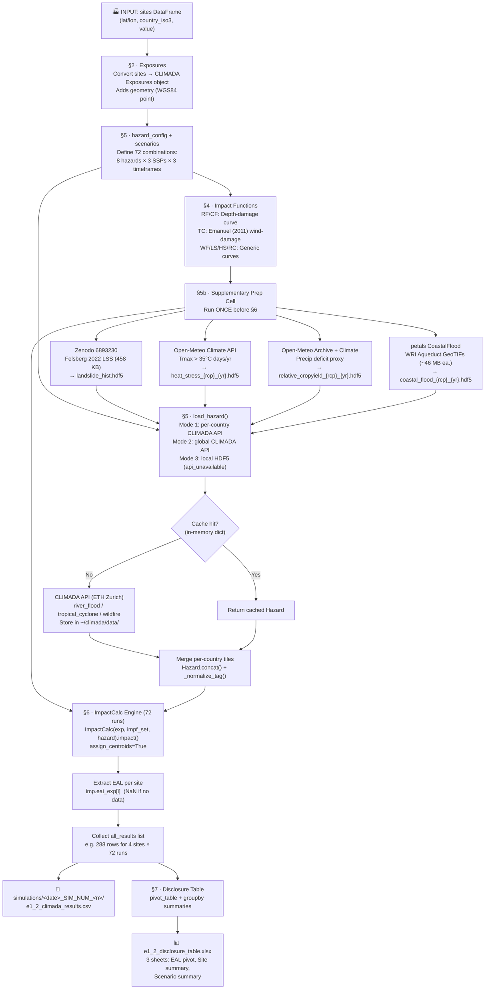

# ESRS E1-2 Climate Physical-Risk Assessment — `load_exposure.ipynb`

> **Audience:** Beginners to climate risk modelling and the CLIMADA framework.
> No prior knowledge of Python beyond running a Jupyter notebook is assumed.

---

## Table of Contents

1. [STAR Overview](#1-star-overview)
2. [Prerequisites & Setup](#2-prerequisites--setup)
3. [How to Run](#3-how-to-run)
4. [Architecture: The 3-Layer Risk Equation](#4-architecture-the-3-layer-risk-equation)
5. [Flowchart](#5-flowchart)
6. [Data Lineage](#6-data-lineage)
7. [Cell-by-Cell Walkthrough](#7-cell-by-cell-walkthrough)
8. [Data Dictionaries](#8-data-dictionaries)
9. [Key Terms & Acronyms Glossary](#9-key-terms--acronyms-glossary)
10. [Known Limitations & Audit Disclosures](#10-known-limitations--audit-disclosures)
11. [ESRS E1-2 Datapoint Mapping](#11-esrs-e1-2-datapoint-mapping)

---

## 1. STAR Overview

### Situation

European companies with global operations must now disclose how physical climate hazards —
floods, storms, extreme rainfall, wildfires, landslides, heat stress, drought, and
sea-level rise — threaten their assets. This is mandated by **ESRS E1-2**
(European Sustainability Reporting Standard, Environment Topic 1, Disclosure 2), part of the
EU Corporate Sustainability Reporting Directive (CSRD).

**The problem:** Traditional qualitative risk assessments ("we are near a river, so flood
risk is High") are no longer sufficient. Auditors and regulators expect a quantified,
scenario-based, probabilistic analysis backed by a credible methodology.

> **Analogy:** Think of your home insurance. The insurer does not just say "you live near
> the coast, so risk is high." They calculate the *exact probability* of flooding at your
> address, the *likely damage* to your home, and charge you a *precise premium*. ESRS E1-2
> asks companies to do the same calculation for all their sites, across three future climate
> futures.

---

### Task

Produce an **Expected Annual Loss (EAL)** — expressed as a fraction of asset value — for
every company site, under every combination of:

- **8 hazards**: River Flooding, Extreme Precipitation, Tropical Storms, Wildfires,
  Landslides, Heat Stress / Heatwaves, Drought & Water Stress, Sea-Level Rise
- **3 climate scenarios**: Low-emission future, Mid-emission future, High-emission future
- **3 time horizons**: Near-term (0–3 yr), Medium-term (3–10 yr), Long-term (10+ yr)

That is **72 combinations per site**. The result must be audit-ready: traceable back to
peer-reviewed methodology, open data, and documented assumptions.

---

### Action

The notebook uses **CLIMADA** (CLIMate ADAptation), an open-source Python library developed
by ETH Zurich and used by EIOPA (the EU insurance regulator) for stress-testing. CLIMADA
provides:

1. A **Data API** that streams open-access, country-level hazard event sets (no manual
   data wrangling required).
2. A **probabilistic risk engine** that applies the fundamental risk equation:

   ```
   Risk = Hazard × Exposure × Vulnerability
   ```

3. **Expected Annual Loss** as the output metric — the average loss you would expect over
   many years, accounting for the full range of event probabilities and severities.

The notebook fetches hazard data per country, assigns vulnerability curves, runs
`ImpactCalc`, and writes the results to a pivot-table Excel workbook ready for insertion
into the sustainability report.

---

### Result

| Output location | Contents |
|---|---|
| `simulations/<date>_SIM_NUM_<n>/e1_2_climada_results.csv` | Raw results: one row per site × hazard × scenario × timeframe (e.g. 288 rows for 4 sites × 72 runs) |
| `e1_2_disclosure_table.xlsx` | Three audit-facing sheets: EAL pivot by site+hazard, site-level summary, scenario summary |

Each execution of §6 creates a new timestamped subfolder under `simulations/` so previous runs are never overwritten.

The EAL values are dimensionless fractions of asset value (e.g., `0.001250` = 0.125% annual
damage). Multiply by actual asset replacement cost to convert to a currency figure.

---

## 2. Prerequisites & Setup

### Software

| Requirement | Version | Notes |
|---|---|---|
| Python | 3.11 | Via conda environment `climada_env_3.11` |
| CLIMADA | 6.1.0 | Core risk engine |
| climada_petals | 6.2.0+ | Required for `CoastalFlood.from_aqueduct_tif()` (§5b sea-level rise) |
| xarray | any recent | Required for §5b landslide NetCDF reading |
| requests | any recent | Required for §5b Open-Meteo and Zenodo downloads |
| pandas | any recent | Included with CLIMADA deps |
| numpy | any recent | Included with CLIMADA deps |
| openpyxl | any recent | Required for `.xlsx` output |

> **`climada_petals` is required** for the §5b coastal-flood prep step, which uses
> `CoastalFlood.from_aqueduct_tif()` to download WRI Aqueduct GeoTIFs. If petals is not
> installed in your kernel, §5b will skip the coastal-flood section and print a message;
> the §6 run loop will record `NaN` for Sea-Level Rise until the HDF5 files are available.
> European extratropical windstorm risk would also need `climada_petals` (`StormEurope`)
> — that is not covered here.

### Internet Access

The notebook uses **two classes of data sources** that require internet access:

**Source 1 — CLIMADA Data API** (ETH Zurich, `data.iac.ethz.ch`) — used for flooding, storms, and wildfire. Files range from ~5 MB (small country, tropical cyclone) to ~130 MB (large country, tropical cyclone).

**Source 2 — Supplementary open APIs** — used by the §5b prep cell for hazards not available in the CLIMADA API:

| Source | Used for | Size | Requires key? |
|---|---|---|---|
| Open-Meteo Climate API (`climate-api.open-meteo.com`) | Heat stress + drought projections | ~200 KB per site | No |
| Open-Meteo ERA5 Archive (`archive-api.open-meteo.com`) | Precipitation baseline (1980–2009) | ~200 KB per site | No |
| Zenodo record 6893230 (Felsberg et al. 2022 LSS) | Landslide susceptibility raster | 458 KB total | No |
| WRI Aqueduct S3 (`wri-projects.s3.amazonaws.com`) | Coastal flood / SLR GeoTIFs (via petals) | ~46 MB per scenario×year | No |

All sources are **free and open-access** with no API key required.

Files are cached locally after the first download:

```
~/climada/data/
  hazard/                      ← CLIMADA system dir; per-hazard subfolders
    river_flood/               ← flood + extreme precip tiles (CLIMADA API)
    tropical_cyclone/          ← storm track event sets (CLIMADA API)
    wildfire/                  ← FIRMS fire-season events (CLIMADA API)
    landslide/                 ← Felsberg 2022 LSS raster + landslide_hist.hdf5 (§5b)
    heat_stress/               ← heat_stress_{rcp}_{yr}.hdf5 (§5b, Open-Meteo)
    relative_cropyield/        ← precip baseline CSV + relative_cropyield_{rcp}_{yr}.hdf5 (§5b)
    coastal_flood/             ← coastal_flood_{rcp}_{yr}.hdf5 (§5b, Aqueduct)
  CoastalFlood/
    Aqueduct/                  ← raw WRI Aqueduct GeoTIFs cached by climada_petals (~46 MB each)
```

Subsequent runs skip the download and load directly from the local cache.

### Hazard Data API Sources

All hazard event sets are downloaded from the **CLIMADA Data API** (ETH Zurich). The table
below shows which external dataset backs each hazard, the publishing organisation, and the
URL you can visit to learn more or verify data provenance for audit purposes.

| Hazard | CLIMADA `haz_type` | CLIMADA API status | Data source (actual) | Alt. source |
|---|---|---|---|---|
| Flooding | `river_flood` | ✅ Fully supported | GloFAS / ISIMIP river-flood depth maps (CLIMADA API) | — |
| Extreme Precipitation | `river_flood` | ✅ Fully supported (same as Flooding) | GloFAS / ISIMIP river-flood depth maps (CLIMADA API) | — |
| Storms | `tropical_cyclone` | ✅ Fully supported | IBTrACS + CLIMADA synthetic tracks (CMIP6, `model_name='random_walk'`) | — |
| Wildfires | `wildfire` | ⚠️ Historical only — API tag `WFseason` normalised to `WF` in `load_hazard` | FIRMS MODIS/VIIRS historical catalog (CLIMADA API, `time_prop=None`) | ISIMIP3b fire projections |
| Landslides | `landslide` | ❌ Not in schema (`ValueError`) | **§5b:** Felsberg et al. 2022 ensemble-mean LSS (Zenodo 6893230, 458 KB) | climada_petals + NASA COOLR |
| Heat Stress / Heatwaves | `heat_stress` | ❌ Not in schema (`ValueError`) | **§5b:** Open-Meteo Climate API — annual days Tmax > 35 °C (CMIP6 MRI_AGCM3_2_S) | ISIMIP3b WBGT |
| Drought & Water Stress | `relative_cropyield` | ⚠️ Global only — `NoResult` per-country; `country_independent=True`; §5b fallback | CLIMADA API (global, first); **§5b fallback:** Open-Meteo precip deficit (proj/baseline) | petals Drought (SPEI) |
| Sea-Level Rise | `coastal_flood` | ❌ Not in schema (`ValueError`) | **§5b:** petals `CoastalFlood.from_aqueduct_tif()` — WRI Aqueduct coastal GeoTIFs | IPCC AR6 SLR tool |

**Status legend:** ✅ = data flows automatically from CLIMADA API · ⚠️ = type exists but needs query adjustment or local fallback · ❌ = type not in CLIMADA ETH API schema (§5b prep required)

> **CLIMADA API:** Metadata at `https://climada.ethz.ch/api/` · Files served from
> `https://data.iac.ethz.ch/climada/` · Called automatically by `Client().get_hazard()`
> for ✅ and ⚠️ hazards.  
> **§5b prep cell** must be run once before §6 to populate local HDF5 files for
> landslide, heat stress, drought (fallback), and sea-level rise.

### Input You Must Supply

The only thing you need to change is the `sites` DataFrame in **Cell 4**:

```python
sites = pd.DataFrame({
    'site_name': [...],   # human-readable label
    'latitude':  [...],   # WGS84 decimal degrees
    'longitude': [...],
    'country_iso3': [...] # 3-letter ISO country code (e.g. 'PHL', 'GBR')
})
```

Everything else (hazard download, vulnerability curves, impact calculation) runs automatically.

---

## 3. How to Run

```bash
# 1. Activate the environment
conda activate climada_env_3.11

# 2. Launch Jupyter
jupyter notebook load_exposure.ipynb

# 3. Run cells §1–§5a in order (imports, exposure, hazard config, impact functions, loader)

# 4. Run the §5b PREP CELL once to download supplementary data:
#    - Landslide susceptibility raster (Zenodo, 458 KB)
#    - Heat stress per scenario × timeframe (Open-Meteo Climate API)
#    - Drought baseline + projections (Open-Meteo Archive + Climate API)
#    - Coastal flood / SLR GeoTIFs (WRI Aqueduct via climada_petals, ~46 MB each)
#    Safe to re-run — existing HDF5 files are skipped.

# 5. Run §6 (72-combination engine) and §7 (disclosure table)
```

**First run — §5b:** Allow 20–45 minutes for the Open-Meteo queries (per-site × 9
scenario×timeframe combinations) and up to 45 minutes for Aqueduct GeoTIF downloads
(~46 MB per unique scenario×year, 5–7 unique files). Subsequent §5b runs skip cached files.

**First run — §6:** Expect 30–90 minutes for CLIMADA API hazard downloads (tropical cyclone
tiles can be 100+ MB each). Subsequent §6 runs load from the local CLIMADA cache and complete
in ~5 minutes.

---

## 4. Architecture: The 3-Layer Risk Equation

```
Risk = Hazard × Exposure × Vulnerability
```

Think of it like baking a cake. You need three ingredients — missing any one means no cake.

| Layer | What it means | Analogy | In this notebook |
|---|---|---|---|
| **Hazard** | The dangerous event itself — how often it happens, how intense | The storm or flood | Downloaded from CLIMADA API (river flood maps, cyclone tracks) |
| **Exposure** | What is in the path of danger | Your house, staff, equipment | The `sites` DataFrame — your company locations |
| **Vulnerability** | How easily things are damaged given the hazard intensity | How well-built your house is | Impact functions (`impf_RF`, `impf_TC`) |

**Expected Annual Loss (EAL)** is what comes out of multiplying all three together and
averaging across all possible events in a year.

> **Insurance analogy:** The EAL is like the "pure risk premium" in an insurance policy —
> the average amount you'd expect to pay out each year before any profit margin. If your
> house has an EAL of 0.2% of its value, and it's worth $500,000, you'd expect ~$1,000
> average annual loss from that hazard.

---

## 5. Flowchart



> If your Markdown viewer does not render Mermaid diagrams, paste the code block at
> [mermaid.live](https://mermaid.live) to view it.

### Plain-English Walkthrough of the Flowchart

1. You provide site locations (latitude/longitude/country).
2. The notebook converts them into a CLIMADA `Exposures` object (adds GPS geometry).
3. A 72-combination run matrix is defined (8 hazards × 3 scenarios × 3 timeframes).
4. Vulnerability curves (impact functions) are built for all 8 hazard types.
5. **§5b prep cell** (run once before §6): downloads supplementary data for the four
   hazards not served by the CLIMADA ETH API, saving one HDF5 per scenario × timeframe
   per hazard under `~/climada/data/hazard/<haz_type>/`. Skips existing files.
6. For each of the 72 combinations, `load_hazard` selects the right mode automatically:
   - *Per-country*: calls `Client().get_hazard()` for each country, merges tiles
   - *Global dataset*: single API call without country filter (drought)
   - *API unavailable*: reads local HDF5 built by §5b (landslide, heat stress, SLR)
   Results are cached in memory; the `WFseason` → `WF` tag normalisation is applied silently.
   Combinations with no data record `NaN` and are logged.
7. `ImpactCalc` produces the EAL per site. Results accumulate in `all_results`.
8. After all 72 runs, results are written to a new timestamped subfolder under `simulations/`.
9. A pivot table and two summary tables are written to `e1_2_disclosure_table.xlsx`.

---

## 6. Data Lineage

Data lineage answers: **"Where did each number come from, and what touched it on the way?"**

```
┌──────────────────────────────────────────────────────────────────────────────────────────────────────────┐
│  EXTERNAL SOURCES                                                                                        │
│                                                                                                          │
│  haz_type             Source                              Provider / fetch path                         │
│  ─────────────────    ─────────────────────────────────   ──────────────────────────────────────────    │
│  river_flood          GloFAS/ISIMIP flood depth maps      CLIMADA API → data.iac.ethz.ch               │
│  tropical_cyclone     IBTrACS + CLIMADA synth. tracks     CLIMADA API → data.iac.ethz.ch               │
│  wildfire             FIRMS MODIS/VIIRS fire events       CLIMADA API → data.iac.ethz.ch               │
│  landslide ★          Felsberg et al. 2022 LSS ensemble   Zenodo 6893230 (458 KB, §5b)                 │
│  heat_stress ★        CMIP6 Tmax via Open-Meteo           climate-api.open-meteo.com (§5b)             │
│  relative_cropyield   ISIMIP rainfed wheat yield loss     CLIMADA API (global); §5b precip fallback    │
│  coastal_flood ★      WRI Aqueduct coastal GeoTIFs        S3 via climada_petals CoastalFlood (§5b)     │
│                                                                                                          │
│  ★ = not in CLIMADA ETH API schema; §5b prep cell creates the local HDF5 files                         │
│                                                                                                          │
│  CLIMADA API metadata:  https://climada.ethz.ch/api/                                                    │
│  CLIMADA file server:   https://data.iac.ethz.ch/climada/                                               │
└──────────────────────────────────────────────────────────────┬───────────────────────────────────────────┘
                                                               │ CLIMADA API → Client.get_hazard()
                                                               │ §5b sources → Hazard.write_hdf5()
                                                               │ cached in ~/climada/data/hazard/<haz_type>/
                                                               ▼
┌─────────────────────────────────────────────────────────────────────────────┐
│  NOTEBOOK INPUTS (you provide)                                              │
│                                                                             │
│  sites DataFrame                                                            │
│    site_name, latitude, longitude, country_iso3,                           │
│    value (default 1.0), headcount, business_area, criticality,             │
│    impf_RF, impf_TC, impf_WF, impf_LS, impf_HS, impf_RC, impf_CF          │
└───────────────────────────────────────┬─────────────────────────────────────┘
                                        │ Exposures(sites)
                                        ▼
                               exp  (Exposures object)
                               exp.gdf  (GeoDataFrame with geometry)
                                        │
                   ┌────────────────────┼──────────────────────┐
                   │                    │                       │
                   ▼                    ▼                       ▼
         impf_sets[tag]         Hazard object          impf_sets[tag]
         (RF/WF/LS/HS/         (merged per-country    (TC/RC/CF curves)
          RC/CF curves)         event set)
                   │                    │                       │
                   └────────────────────┼──────────────────────┘
                                        │ ImpactCalc(exp, impf_set, hazard).impact()
                                        ▼
                               imp.eai_exp  [array, one value per site]
                               = Expected Annual Loss fraction
                                        │
                                        ▼
                            all_results  (list of dicts)
                            One entry per site × hazard × scenario × timeframe
                            = 4 sites × 72 combinations = 288 rows
                                        │
                          ┌─────────────┴──────────────┐
                          ▼                            ▼
              e1_2_climada_results.csv      results_df  (DataFrame)
              (long-format raw results)               │
                                           ┌──────────┼────────────┐
                                           ▼          ▼            ▼
                                         pivot   site_summary  scenario_summary
                                           │          │            │
                                           └──────────┴────────────┘
                                                      │
                                                      ▼
                                       e1_2_disclosure_table.xlsx
                                       (3 sheets, audit-ready)
```

### Hazard API Source Reference

| Hazard | CLIMADA `haz_type` | API status | Data source (actual) | Higher-fidelity alt. |
|---|---|---|---|---|
| Flooding | `river_flood` | ✅ Supported | GloFAS / ISIMIP depth maps (CLIMADA API) | — |
| Extreme Precipitation | `river_flood` | ✅ Supported (same tile) | GloFAS / ISIMIP depth maps (CLIMADA API) | — |
| Storms | `tropical_cyclone` | ✅ Supported | IBTrACS + CLIMADA synth. tracks (CMIP6) | — |
| Wildfires | `wildfire` | ⚠️ Historical — tag `WFseason` normalised to `WF` | FIRMS MODIS/VIIRS catalog; same baseline for all 9 cells | ISIMIP3b fire projections |
| Landslides | `landslide` | ❌ Not in schema | **§5b:** Felsberg et al. 2022 LSS (Zenodo 6893230) | NASA COOLR + petals Landslide |
| Heat Stress | `heat_stress` | ❌ Not in schema | **§5b:** Open-Meteo Climate API, annual Tmax > 35 °C days | ISIMIP3b WBGT |
| Drought | `relative_cropyield` | ⚠️ Global — `country_independent=True`; §5b fallback | CLIMADA API (global); **§5b fallback:** Open-Meteo precip deficit | petals Drought (SPEI) |
| Sea-Level Rise | `coastal_flood` | ❌ Not in schema | **§5b:** petals `CoastalFlood.from_aqueduct_tif()` (WRI Aqueduct) | IPCC AR6 SLR tool |

**CLIMADA Data API endpoints:**

| Endpoint | URL | Purpose |
|---|---|---|
| Metadata API | `https://climada.ethz.ch/api/` | Browse available datasets by `haz_type`, country, scenario, year |
| File server | `https://data.iac.ethz.ch/climada/` | `.hdf5` downloads (called by `Client.get_hazard()`) |

---

## 7. Cell-by-Cell Walkthrough

### Cell 1 · Imports

```python
import pandas as pd
import numpy as np
from climada.entity import Exposures, ImpactFuncSet, ImpactFunc, ImpfTropCyclone
from climada.hazard import Hazard
from climada.engine import ImpactCalc
from climada.util.api_client import Client
```

**What this does:** Loads all the libraries the notebook depends on.

| Import | Purpose |
|---|---|
| `pandas` | Table (DataFrame) operations — reading, filtering, pivoting results |
| `numpy` | Numerical arrays — used to define vulnerability curve data points |
| `Exposures` | CLIMADA class that wraps your site locations as a GIS-aware table |
| `ImpactFuncSet` | Container that holds one or more vulnerability curves |
| `ImpactFunc` | A single vulnerability curve (e.g., flood depth → damage fraction) |
| `ImpfTropCyclone` | Pre-built tropical cyclone vulnerability curve (Emanuel 2011) |
| `Hazard` | CLIMADA class that holds a probabilistic event set (thousands of flood/storm scenarios) |
| `ImpactCalc` | The risk engine: takes Exposures + ImpactFuncSet + Hazard → computes losses |
| `Client` | CLIMADA's API client for downloading hazard datasets from ETH Zurich |

---

### Cell 2 · Imports (Section Header — markdown only)

No code. Just the "Section 1 · Imports" heading.

---

### Cell 3 · Markdown Explanation (Section 2 header — markdown only)

Explains what "exposure" means and why `value = 1.0` is used as a default.

---

### Cell 4 · Load the Exposure (`sites` DataFrame + `Exposures` object)

```python
sites = pd.DataFrame({ ... })
exp = Exposures(sites)
exp.check()
exp.gdf.head()
```

**What this does:** Defines your company's sites and wraps them in a CLIMADA `Exposures`
object. This is the **only cell you need to edit** to use the notebook for your own company.

**Output:** A GeoDataFrame (`exp.gdf`) — a regular table enhanced with a `geometry` column
that stores the GPS location as a point, enabling spatial matching with hazard grids.

> **Analogy:** Imagine plotting your offices on Google Maps. The `Exposures` object is
> exactly that map — each pin is a site with its details attached.

**What `exp.check()` does:** Validates that the Exposures object is internally consistent
(all required columns present, no missing coordinates, impact-function IDs are integers, etc.).
It raises an error early rather than letting problems surface later during the risk calculation.

**What `exp.gdf` is:** `gdf` stands for *GeoDataFrame* (from the `geopandas` library).
It is your `sites` table with an extra `geometry` column added automatically by CLIMADA.

---

### Cell 5 · Define the 72-Run Matrix (`scenarios` + `hazard_config`)

```python
scenarios = {
    'SSP1-1.9': 'rcp26',
    'SSP2-4.5': 'rcp60',
    'SSP3-7.0': 'rcp85',
}
hazard_config = { ... }
COUNTRIES = sites['country_iso3'].unique().tolist()
```

**What this does:** Defines the full matrix of what will be computed. Think of it as the
"menu" — 72 dishes, each a unique combination of hazard + scenario + timeframe.

#### `scenarios` dictionary

Maps ESRS-standard scenario names (SSP labels) to the RCP codes used by the CLIMADA API.

| SSP Label | Warming | RCP Code | Plain English |
|---|---|---|---|
| SSP1-1.9 | ~+1.5 °C | `rcp26` | Best case — strong global climate action |
| SSP2-4.5 | ~+2.7 °C | `rcp60` | Middle road — some action, some delay |
| SSP3-7.0 | ~+3.6 °C | `rcp85` | Worst case — business as usual |

> **Why is SSP2-4.5 mapped to rcp60 and not rcp45?** The CLIMADA river-flood dataset does
> not have an `rcp45` tile. Using `rcp60` for both hazards keeps the scenario consistent.
> This substitution must be disclosed in the audit narrative.

#### `hazard_config` dictionary

Each key (`'Flooding'`, `'Extreme Precip.'`, `'Storms'`, `'Wildfires'`, `'Landslides'`,
`'Heat Stress'`, `'Drought & Water Stress'`, `'Sea-Level Rise'`) maps to a sub-dictionary with:

| Key | Type | Purpose |
|---|---|---|
| `haz_type` | string | CLIMADA API hazard type identifier (e.g., `'river_flood'`, `'wildfire'`, `'relative_cropyield'`) |
| `tag` | string | Short code matching the impact function (e.g., `'RF'`, `'TC'`, `'WF'`, `'LS'`, `'HS'`, `'RC'`, `'CF'`) |
| `impf_col` | string | Column in `sites` DataFrame that links each site to its vulnerability curve ID |
| `time_prop` | string | API property name for the time dimension (`'year_range'` or `'ref_year'`) |
| `timeframes` | dict | Maps ESRS horizon label → API time value |
| `extra_props` | dict | Additional API filters; `model_name='random_walk'` selects the correct TC dataset |

#### Time dimension mapping

The two hazard types express time differently in the API:

| Hazard | Time property | Values | Meaning |
|---|---|---|---|
| River flood, Wildfire, Landslide, Heat Stress, Drought, Sea-Level Rise | `year_range` | `'2010_2030'`, `'2030_2050'`, `'2050_2070'` | A 20-year window average |
| Tropical cyclone | `ref_year` | `'2040'`, `'2060'`, `'2080'` | A snapshot at that year |

> **Analogy:** The flood data is like a 20-year average temperature — it smooths out
> year-to-year noise. The cyclone data is like a photograph taken at a specific year —
> it captures conditions at that exact point in time.

> **Drought extra properties:** The drought hazard uses `haz_type='relative_cropyield'`
> with `extra_props={'crop_type': 'whe', 'irrigation_type': 'rf'}`. This selects
> the rainfed wheat yield-loss dataset — the best available CLIMADA open-API proxy for
> drought and water-stress impacts on supply chains.

#### `COUNTRIES`

A deduplicated list of ISO3 country codes from the `sites` table. The hazard loader uses
this to download one tile per country and merge them into a single event set.

---

### Cell 6 · Markdown (Section 3 header — markdown only)

No code. Explains scenarios and time-horizon mapping in narrative form.

---

### Cell 7 · Markdown (Section 4 header — markdown only)

No code. Introduces impact functions.

---

### Cell 8 · Build the Impact (Vulnerability) Functions

```python
impf_tc = ImpfTropCyclone.from_emanuel_usa()
impf_rf = ImpactFunc(id=1, haz_type='RF', ...)
impf_wf = ImpactFunc(id=1, haz_type='WF', ...)
impf_ls = ImpactFunc(id=1, haz_type='LS', ...)
impf_hs = ImpactFunc(id=1, haz_type='HS', ...)
impf_rc = ImpactFunc(id=1, haz_type='RC', ...)
impf_cf = ImpactFunc(id=1, haz_type='CF', ...)
impf_sets = {
    'RF': ImpactFuncSet([impf_rf]), 'TC': ImpactFuncSet([impf_tc]),
    'WF': ImpactFuncSet([impf_wf]), 'LS': ImpactFuncSet([impf_ls]),
    'HS': ImpactFuncSet([impf_hs]), 'RC': ImpactFuncSet([impf_rc]),
    'CF': ImpactFuncSet([impf_cf]),
}
```

**What this does:** Defines how damage grows with hazard intensity for all 8 hazard types.

> **Analogy:** Think of a car crash test. Engineers have tables that say "at 30 km/h,
> damage is 10%; at 60 km/h, damage is 40%; at 100 km/h, damage is 90%." Impact functions
> are the same idea — a lookup table mapping intensity to damage fraction.

#### Tropical Cyclone Function — `ImpfTropCyclone.from_emanuel_usa()`

Uses the **Emanuel (2011)** calibration, a peer-reviewed formula derived from Atlantic
hurricane loss records. It maps **maximum sustained wind speed (m/s)** to a damage fraction
between 0 and 1.

| Parameter | Value |
|---|---|
| `haz_type` | `'TC'` |
| `id` | `1` (links to `impf_TC=1` in the `sites` table) |
| Intensity unit | m/s (wind speed) |
| Damage at 0 m/s | 0 |
| Damage at ~70 m/s | ~1.0 (total loss) |

#### River Flood Function — `ImpactFunc(haz_type='RF', ...)`

A **JRC-style depth-damage curve** mapping flood water depth (metres) to damage fraction.

| Depth (m) | Damage fraction (MDD) | Meaning |
|---|---|---|
| 0.0 | 0.00 | Dry — no damage |
| 0.5 | 0.15 | Ankle-deep — minor damage |
| 1.0 | 0.30 | Knee-deep — significant damage |
| 1.5 | 0.45 | Waist-deep — heavy damage |
| 2.0 | 0.55 | Above waist — major damage |
| 3.0 | 0.70 | — |
| 5.0 | 0.85 | — |
| 10.0 | 1.00 | Fully submerged — total loss |

#### Wildfire Function — `ImpactFunc(haz_type='WF', ...)`

Maps **Fire Weather Index (FWI) category** (0 = no fire weather, 5 = extreme) to damage fraction.

| FWI category | Damage fraction | Meaning |
|---|---|---|
| 0 | 0.00 | No fire weather |
| 1 | 0.05 | Low — minor scorching risk |
| 2 | 0.15 | Moderate |
| 3 | 0.35 | High |
| 4 | 0.65 | Very high |
| 5 | 1.00 | Extreme — near-total loss |

#### Landslide Function — `ImpactFunc(haz_type='LS', ...)`

Maps **susceptibility index** (0–1) to damage fraction. A site rated 0.75 on global
landslide-susceptibility maps has a 60% expected damage degree per event.

#### Heat Stress Function — `ImpactFunc(haz_type='HS', ...)`

Maps **annual exceedance days above the WBGT threshold** to an **operational disruption
fraction**. This captures labour productivity loss and outdoor-asset downtime, not direct
structural damage.

| Exceedance days/yr | Disruption fraction |
|---|---|
| 0 | 0.00 |
| 5 | 0.02 |
| 10 | 0.05 |
| 20 | 0.12 |
| 30 | 0.25 |
| 50 | 0.50 |
| 100 | 0.80 |

> For indoor-only assets, reduce `paa` (percentage of assets affected) to reflect that
> temperature-controlled buildings are largely unaffected.

#### Drought / Water Stress Function — `ImpactFunc(haz_type='RC', ...)`

Maps **fractional crop-yield loss** (0 = no loss, 1 = total loss) to a supply-chain and
water-availability disruption fraction. Rainfed wheat yield loss is the CLIMADA proxy for
regional drought severity.

#### Sea-Level Rise / Coastal Flood Function — `ImpactFunc(haz_type='CF', ...)`

Uses the same JRC-style depth-damage curve as river flood, applied to **coastal inundation
depth (metres)** combining SLR and storm-surge scenarios.

**`ImpactFunc` parameters explained:**

| Parameter | Description |
|---|---|
| `id` | Integer identifier. Must match the `impf_{TAG}` column in `sites`. |
| `haz_type` | Must match the tag returned by the CLIMADA API (e.g., `'RF'`, `'TC'`, `'WF'`). |
| `name` | Human-readable label (not used in calculations). |
| `intensity` | Array of hazard intensity values. |
| `mdd` | **Mean Damage Degree** — fraction of asset value damaged (0–1). |
| `paa` | **Percentage of Assets Affected** — fraction of assets at the site exposed to the hazard. |
| `intensity_unit` | Unit label for the intensity axis. |

#### `impf_sets` dictionary

Groups impact functions by their hazard tag. `ImpactCalc` selects the right set per run
using `cfg['tag']` (one of `'RF'`, `'TC'`, `'WF'`, `'LS'`, `'HS'`, `'RC'`, `'CF'`).

---

### Cell 9 · Markdown (§5 header — markdown only)

No code. Explains the three `load_hazard` modes (per-country, global, API-unavailable)
and the two robustness features (graceful gaps + in-memory caching).

---

### Cell 10 · Hazard Loader (`load_hazard` function)

```python
import time
from climada.util.api_client import Download
from climada.util.constants import SYSTEM_DIR as _CLIMADA_SYSTEM_DIR

client = Client()
_hazard_cache = {}
_LOCAL_HAZ_BASE = Path(_CLIMADA_SYSTEM_DIR) / 'hazard'

def load_hazard(cfg, rcp_code, time_value): ...
```

**What this does:** Defines the function that returns one merged `Hazard` object for a
given configuration, RCP scenario, and time value. It operates in three modes:

| Mode | Flag in `hazard_config` | Used for | Behaviour |
|---|---|---|---|
| **Per-country** | *(default)* | `river_flood`, `tropical_cyclone`, `wildfire` | One API call per country in `COUNTRIES`; tiles merged with `Hazard.concat()` |
| **Global dataset** | `country_independent=True` | `relative_cropyield` | One API call without `country_iso3alpha`; falls back to §5b local HDF5 if `NoResult` |
| **API unavailable** | `api_unavailable=True` | `landslide`, `heat_stress`, `coastal_flood` | Reads local HDF5 created by §5b; returns `None` if file absent |

#### `_LOCAL_HAZ_BASE`

Points to `~/climada/data/hazard/`. The §5b files are stored in per-hazard subfolders here
(e.g., `~/climada/data/hazard/heat_stress/`). `load_hazard` resolves the file path as:

```
{haz_type}_{rcp_code}_{time_value}.hdf5   (when time_prop is not None)
{haz_type}_hist.hdf5                       (when time_prop is None — e.g. landslide)
```

#### `_normalize_tag(haz)`

Called on every `Hazard` returned from the API before it is cached. If the API's internal
`haz.haz_type` differs from `cfg['tag']`, it is silently corrected. This handles the
wildfire case where the API returns `haz_type='WFseason'` but the exposure and impact
function use `'WF'`. Without normalisation, `ImpactCalc` would raise `AttributeError`
because it cannot find the `impf_WFseason` column in the exposure table.

#### `_hazard_cache = {}`

A Python dictionary storing `(haz_type, rcp_code, time_value)` → `Hazard`. If the same
triplet is requested again, the cached object is returned immediately — no network call.

> **Why is this important?** `Flooding` and `Extreme Precip.` share `river_flood` data.
> Without caching, each of the 9 scenario×timeframe combinations would re-download the
> same files twice. For `time_prop=None` hazards (wildfire, landslide), the cache key
> collapses `rcp_code` and `time_value` to `None`, so all 9 cells reuse one fetch.

#### Retry logic (per-country and global modes)

| Exception | Cause | Action |
|---|---|---|
| `ChunkedEncodingError` | Network dropped mid-download | Purge stale DB lock, sleep 5 s, retry once |
| `Failed` | Prior interrupted download left a stale DB entry | Same — purge and retry |
| `NoResult` | No dataset for this combination (e.g., TC rcp85+2080) | Log and skip; EAL recorded as NaN |
| Any other | Unexpected error | Log and skip |

#### `Hazard.concat(parts)`

Merges per-country `Hazard` objects into a single event set covering all sites, so
`ImpactCalc` can find the nearest hazard centroid for any site regardless of country.

---

### Cell 11 · §5b Supplementary Hazard Prep (code cell — run once before §6)

**What this does:** Downloads and packages hazard data for the four hazard types that are
not served by the CLIMADA ETH API, saving one CLIMADA-format HDF5 file per
scenario × timeframe into `~/climada/data/hazard/<haz_type>/`.

The cell is **idempotent** — if a file already exists it is skipped immediately. It also
starts by probing each external API (`HEAD` request) and skips any section whose source
is unreachable, logging the outcome rather than crashing.

**Landslide susceptibility (Zenodo 6893230)**

Downloads `FelsbergEtAl2022_LSS_ensavg.nc4c` (458 KB) — a global ensemble-mean
landslide susceptibility index on a 0–1 scale. Extracts the value at each site using
`xr.Dataset.sel(method='nearest')` and creates a single-event `Hazard('LS')` with
`intensity = susceptibility index`. Because susceptibility is static (no climate
projections), the same file `landslide_hist.hdf5` is reused for all 9 cells by
`load_hazard` when `time_prop=None`.

**Heat stress (Open-Meteo Climate API)**

Queries `climate-api.open-meteo.com` per site per scenario×timeframe for daily
`temperature_2m_max` (CMIP6 model MRI_AGCM3_2_S). Computes the mean annual count of
days with Tmax > 35 °C and stores it as `Hazard('HS')` intensity. One HDF5 file per
`(rcp, yr_key)` combination (9 files total).

**Drought / water stress (Open-Meteo Archive + Climate API)**

Step A: fetches ERA5 daily precipitation 1980–2009 from `archive-api.open-meteo.com`
per site and computes mean annual baseline (mm/yr). Cached as a CSV for subsequent runs.

Step B: fetches projected precipitation per scenario×timeframe from the Climate API.
Computes the fractional precipitation deficit: `max(0, 1 – projected/baseline)`,
naturally on a 0–1 scale matching the existing `impf_RC` impact function. Stored as
`Hazard('RC')`, used as a fallback when the CLIMADA API returns `NoResult`.

**Sea-Level Rise / Coastal Flood (WRI Aqueduct via `climada_petals`)**

Calls `CoastalFlood.from_aqueduct_tif()` once per country per Aqueduct scenario×year.
Raw GeoTIFs (~46 MB each) are cached by petals in `~/climada/data/CoastalFlood/Aqueduct/`.
Results are merged with `Hazard.concat()`, `haz_type` is forced to `'CF'`, and
`frequency = 0.01` (1-in-100yr return period). Aqueduct RCP mapping:

| Notebook RCP | Aqueduct scenario | Aqueduct target year |
|---|---|---|
| `rcp26` | `historical` (conservative lower bound; no RCP2.6 published) | `hist` |
| `rcp60` | `45` (RCP4.5) | `2030`, `2050`, `2080` |
| `rcp85` | `85` (RCP8.5) | `2030`, `2050`, `2080` |

---

### Cell 12 · Markdown (§6 header — markdown only)

No code. Explains the 72-run engine and the §5b prerequisite.

---

### Cell 13 · Pre-Run Cache Purge

```python
from pathlib import Path
from climada.util.api_client import Download

for _d in list(Download.select()):
    if _d.enddownload is None and _tc_haz_type in _d.path:
        _d.delete_instance()
```

**What this does:** Before starting the 72-run loop, clears any stale entries from the
CLIMADA download-tracking SQLite database.

> **Analogy:** Before checking books out of a library, you return any items that were
> signed out but never actually borrowed (maybe the librarian marked them as "in transit"
> but they never left). Without this step, the library refuses to let you borrow them again.

#### What is the `Download` table?

CLIMADA uses a local SQLite database to track file downloads. Each row represents one
file download attempt with these fields:

| Field | Description |
|---|---|
| `id` | Auto-increment primary key |
| `url` | The remote URL of the file |
| `path` | The absolute local path where the file is/was being saved |
| `startdownload` | Timestamp when the download began |
| `enddownload` | Timestamp when the download completed (`NULL` if still in progress or interrupted) |

A **stale entry** is any row where `enddownload IS NULL`. These are left behind when a
download is interrupted (power cut, network drop, kernel restart).

#### Why query the DB instead of using `glob`?

A `glob` scan only finds files that *exist on disk*. But a download can be interrupted
*before any data is written* — the file never appears on disk, yet the DB entry blocks
the next attempt. Querying `Download.select()` directly catches all stale entries regardless
of whether a file exists.

---

### Cell 14 · The 72-Run Engine (main loop)

```python
for haz_name, cfg in hazard_config.items():
    for ssp_name, rcp_code in scenarios.items():
        for tf_name, tf_value in cfg['timeframes'].items():
            hazard = load_hazard(cfg, rcp_code, tf_value)
            imp = ImpactCalc(exp, impf_sets[cfg['tag']], hazard).impact(
                save_mat=False, assign_centroids=True)
            for i, name in enumerate(sites['site_name']):
                eal_by_site[name] = float(imp.eai_exp[i])
```

**What this does:** The core of the notebook. Iterates all 72 combinations and computes
EAL for each site.

#### `ImpactCalc(exp, impf_sets[cfg['tag']], hazard)`

Creates an impact calculator by combining the three risk layers:

| Argument | What it represents |
|---|---|
| `exp` | Exposure — your sites |
| `impf_sets[cfg['tag']]` | Vulnerability — the flood or cyclone damage curve |
| `hazard` | Hazard — the downloaded event set |

#### `.impact(save_mat=False, assign_centroids=True)`

Runs the risk calculation. Two parameters:

| Parameter | Value | Meaning |
|---|---|---|
| `save_mat` | `False` | Do not save the full loss matrix (saves memory — we only need the final EAL) |
| `assign_centroids` | `True` | Automatically find the nearest hazard grid point for each site |

> **What is a centroid?** The hazard grid (e.g., flood map) is divided into cells. Each
> cell has a centre point called a centroid. `assign_centroids=True` tells CLIMADA to match
> each site to the nearest centroid — like snapping your GPS pin to the nearest weather
> station.

#### `imp.eai_exp`

A NumPy array with one element per site (in the same order as `exp.gdf`). Each value is
the **Expected Annual Loss** for that site, expressed as a fraction of `value`.

> **Example:** If `imp.eai_exp[0] = 0.001250`, the Manila Warehouse has a 0.125% expected
> annual damage rate. With `value = 1.0` (the default), this is already the damage fraction.
> If Manila WH has a replacement cost of ₱50M, the expected annual loss is ₱50M × 0.00125
> = ₱62,500 per year on average.

#### `all_results` list

After each of the 72 runs, one dictionary is appended per site. This is the "ledger" that
accumulates every result before being converted to a DataFrame.

#### Progress indicator

```
[ 1/72] Flooding | SSP1-1.9 | Short (0-3yr)
```

Shows which of the 72 combinations is running. Notes are printed for any gap:

```
    - no tropical_cyclone for GBR (rcp85, 2080): NoResult
    -> §5b prep cell not yet run — alt: Run §5b prep cell (Open-Meteo Climate API) ...
```

The second message appears when `api_unavailable=True` and the §5b HDF5 file is missing.
Run §5b first to eliminate these gaps.

#### Output files

Results are written to a new timestamped subfolder each run:

```
simulations/
  <YYYYMMDD>_SIM_NUM_1/
    e1_2_climada_results.csv
  <YYYYMMDD>_SIM_NUM_2/      ← second run on the same day
    e1_2_climada_results.csv
```

The subfolder counter resets daily (it counts only folders with today's date prefix).

---

### Cell 15 · Markdown (§7 header — markdown only)

No code. Explains the disclosure table structure.

---

### Cell 16 · Generate the E1-2 Disclosure Table

```python
pivot = results_df.pivot_table(...)
site_summary = results_df.groupby('site_name').agg(...)
scenario_summary = results_df.groupby(['scenario', 'timeframe']).agg(...)
with pd.ExcelWriter('e1_2_disclosure_table.xlsx') as xl: ...
```

**What this does:** Transforms the raw 108-row results into three audit-facing views and
writes them to Excel.

#### `pivot_table`

Reshapes the long-format results into a wide table. Each row is one site+hazard combination;
each column is one scenario+timeframe pair.

> **Analogy:** Like a school report card. Rows are subjects (site + hazard), columns are
> exams (scenario × timeframe), and each cell is the grade (EAL).

#### `site_summary`

Groups by `site_name` to produce a single row per site with aggregated metrics. Used to
identify which sites face the most risk overall.

#### `scenario_summary`

Groups by `scenario` and `timeframe` to show how total portfolio risk grows across the
climate pathway. Used to answer "does our risk get worse under high-emissions futures?"

---

### Cell 17 · ESRS Mapping Table (§8, markdown only)

No code. Provides a paragraph-by-paragraph mapping of notebook outputs to the ESRS E1-2
disclosure requirements (§14, §15, §16, AR6), and the full list of documented limitations
for each hazard. Use this section when drafting the sustainability report narrative.

---

## 8. Data Dictionaries

### 8.1 Input: `sites` DataFrame

The only data you must supply. All columns except `latitude`, `longitude`, and `country_iso3`
have defaults or can be omitted if not yet known.

| Column | Type | Required | Example | Description |
|---|---|---|---|---|
| `site_name` | string | Yes | `'Manila WH'` | Human-readable site identifier. Carries through to all outputs. |
| `latitude` | float | Yes | `14.5995` | WGS84 decimal degrees. North is positive. |
| `longitude` | float | Yes | `120.9842` | WGS84 decimal degrees. East is positive. |
| `country_iso3` | string | Yes | `'PHL'` | ISO 3166-1 alpha-3 country code. Used to select the correct hazard tile from the API. |
| `value` | float | No (default 1.0) | `1.0` | Asset replacement value in your chosen currency. With `1.0`, EAL is a fraction. Replace with actual cost to get monetary EAL. |
| `headcount` | int | No | `120` | Number of employees at the site. Used in the E1-2 sensitivity narrative (AR 6(b)). Not used in risk math. |
| `business_area` | string | No | `'Logistics'` | Business function of the site. Enrichment only. |
| `criticality` | string | No | `'High'` | Operational criticality level. Enrichment only. |
| `impf_RF` | int | Yes | `1` | ID of the river-flood impact function. Must match an `id` in `impf_sets['RF']`. |
| `impf_TC` | int | Yes | `1` | ID of the tropical-cyclone impact function. Must match an `id` in `impf_sets['TC']`. |
| `impf_WF` | int | Yes | `1` | ID of the wildfire impact function. Must match an `id` in `impf_sets['WF']`. |
| `impf_LS` | int | Yes | `1` | ID of the landslide impact function. Must match an `id` in `impf_sets['LS']`. |
| `impf_HS` | int | Yes | `1` | ID of the heat-stress impact function. Must match an `id` in `impf_sets['HS']`. |
| `impf_RC` | int | Yes | `1` | ID of the drought/water-stress impact function (relative cropyield). Must match an `id` in `impf_sets['RC']`. |
| `impf_CF` | int | Yes | `1` | ID of the coastal-flood / SLR impact function. Must match an `id` in `impf_sets['CF']`. |

---

### 8.2 `exp.gdf` — The Exposures GeoDataFrame

Output of `Exposures(sites)`. Identical to `sites` plus one extra column added by CLIMADA:

| Column | Type | Description |
|---|---|---|
| *(all columns from `sites`)* | — | Carried through unchanged |
| `geometry` | shapely Point | GPS location as a point geometry: `POINT (longitude latitude)` |

---

### 8.3 `simulations/<date>_SIM_NUM_<n>/e1_2_climada_results.csv` — Raw Results

One row per site per combination. For 4 sites × 72 combinations = 288 rows per run.
Each §6 execution creates a new timestamped subfolder so previous runs are never overwritten.

| Column | Type | Example | Description |
|---|---|---|---|
| `site_name` | string | `'Manila WH'` | Site identifier |
| `latitude` | float | `14.5995` | WGS84 latitude |
| `longitude` | float | `120.9842` | WGS84 longitude |
| `country_iso3` | string | `'PHL'` | ISO3 country code |
| `headcount` | int | `120` | From input `sites` |
| `business_area` | string | `'Logistics'` | From input `sites` |
| `criticality` | string | `'High'` | From input `sites` |
| `hazard` | string | `'Flooding'` | One of: `'Flooding'`, `'Extreme Precip.'`, `'Storms'`, `'Wildfires'`, `'Landslides'`, `'Heat Stress'`, `'Drought & Water Stress'`, `'Sea-Level Rise'` |
| `scenario` | string | `'SSP1-1.9'` | One of: `'SSP1-1.9'`, `'SSP2-4.5'`, `'SSP3-7.0'` |
| `timeframe` | string | `'Short (0-3yr)'` | One of: `'Short (0-3yr)'`, `'Medium (3-10yr)'`, `'Long (10+yr)'` |
| `eal` | float or NaN | `0.001250` | Expected Annual Loss as a fraction of `value`. `NaN` = no API data for this combination. |

---

### 8.4 `e1_2_disclosure_table.xlsx` — Sheet: `EAL_by_site_hazard`

The main audit artefact. A pivot table.

**Rows (index):** Each unique `(site_name, business_area, criticality, headcount, hazard)` combination.

**Columns (multi-level header):**

```
scenario      SSP1-1.9                    SSP2-4.5                    SSP3-7.0
timeframe     Short  Medium  Long         Short  Medium  Long         Short  Medium  Long
```

**Cell values:** EAL as a fraction of asset value for that site/hazard/scenario/timeframe.
`NaN` = no data available from the API.

---

### 8.5 `e1_2_disclosure_table.xlsx` — Sheet: `Site_summary`

One row per site, sorted by `total_eal` descending (most exposed first).

| Column | Description |
|---|---|
| `site_name` | Site identifier (index) |
| `total_eal` | Sum of EAL across all 72 combinations. Higher = more exposed overall. |
| `peak_hazard_eal` | Maximum single-combination EAL. Identifies the worst-case hazard+scenario+timeframe. |
| `headcount` | Number of employees (from input). |
| `criticality` | Operational criticality (from input). |

---

### 8.6 `e1_2_disclosure_table.xlsx` — Sheet: `Scenario_summary`

One row per scenario+timeframe combination (9 rows). Shows portfolio-wide risk trajectory.

| Column | Description |
|---|---|
| `scenario` | SSP scenario label |
| `timeframe` | Time horizon label |
| `total_eal` | Sum of EAL across all sites and all hazards for this combination. |
| `max_site_eal` | Highest single-site EAL in this combination. |
| `sites_at_risk` | Count of site+hazard rows where `eal > 0`. |

---

## 9. Key Terms & Acronyms Glossary

| Term | Full Name | Plain-English Explanation |
|---|---|---|
| **CLIMADA** | CLIMate ADAptation | Open-source risk modelling platform from ETH Zurich. It is the "engine" running all calculations. |
| **CSRD** | Corporate Sustainability Reporting Directive | EU law requiring large companies to report sustainability data, including climate risks. |
| **ESRS** | European Sustainability Reporting Standards | The specific reporting templates under CSRD. **E1-2** covers physical climate risk identification. |
| **EFRAG** | European Financial Reporting Advisory Group | The EU body that writes the ESRS standards. |
| **SSP** | Shared Socioeconomic Pathway | A set of five storylines describing how society and emissions might develop. SSP1 = sustainability; SSP3 = rivalry and high emissions. |
| **RCP** | Representative Concentration Pathway | An older (CMIP5) set of emissions pathways indexed by radiative forcing (watts/m²). The CLIMADA API uses RCP codes. SSPs are mapped to RCPs for data access. |
| **EAL** | Expected Annual Loss | The average loss you would expect per year if you could replay many years. Like an insurance premium. Expressed here as a fraction of asset value. |
| **Hazard** | — | The physical danger: flood water, wind speed, rainfall. In CLIMADA, a `Hazard` object holds thousands of simulated events and their probabilities. |
| **Exposure** | — | What is at risk: buildings, people, equipment. In CLIMADA, the `Exposures` object holds your site locations and values. |
| **Vulnerability** | — | How easily assets are damaged at a given hazard intensity. Encoded as an impact function (damage curve). |
| **Impact Function** | — | A lookup table mapping hazard intensity (e.g., flood depth in metres) to damage fraction (0–1). |
| **MDD** | Mean Damage Degree | The fraction of an asset's value that is damaged at a given intensity. Component of the impact function. |
| **PAA** | Percentage of Assets Affected | The fraction of assets at a site that are exposed to the hazard at all. Usually 1 (100%). Component of the impact function. |
| **haz_type** | Hazard Type | CLIMADA's internal code for a hazard family: `'river_flood'`, `'tropical_cyclone'`, etc. |
| **RF** | River Flood | Short tag used in CLIMADA for river-flood and extreme-precipitation hazard functions and exposure columns. |
| **TC** | Tropical Cyclone | Short tag used in CLIMADA for tropical cyclone hazard functions and exposure columns. |
| **WF** | Wildfire | CLIMADA haz_type tag for wildfire event sets (FIRMS-based). |
| **LS** | Landslide | CLIMADA haz_type tag for landslide susceptibility/frequency datasets. |
| **HS** | Heat Stress | CLIMADA haz_type tag for ISIMIP heat-stress exceedance datasets. |
| **RC** | Relative Cropyield | CLIMADA haz_type tag for the ISIMIP relative crop-yield loss dataset — used here as a proxy for drought and water-stress risk. |
| **CF** | Coastal Flood | CLIMADA haz_type tag for coastal inundation / sea-level rise datasets. |
| **FWI** | Fire Weather Index | A composite index (0–5) combining temperature, humidity, wind speed, and fuel moisture to estimate wildfire risk. Used as the intensity metric for the wildfire impact function. |
| **WBGT** | Wet-Bulb Globe Temperature | A heat-stress index combining temperature and humidity. The CLIMADA heat-stress datasets count annual exceedance days above a WBGT threshold. |
| **FIRMS** | Fire Information for Resource Management System | NASA's near-real-time wildfire detection system using MODIS and VIIRS satellite data. Underpins the CLIMADA wildfire event sets. |
| **WaterGAP** | Water Global Assessment and Prognosis | A global hydrological model used for quantitative water-stress assessments (not included in this notebook; cited as an alternative for drought analysis). |
| **Centroid** | — | The centre point of a hazard grid cell. `assign_centroids=True` snaps each site to the nearest centroid so the correct hazard intensity is used. |
| **IBTrACS** | International Best Track Archive for Climate Stewardship | The global historical tropical cyclone database used to calibrate CLIMADA's synthetic storm tracks. |
| **ISIMIP** | Inter-Sectoral Impact Model Intercomparison Project | The scientific project that produced the global river-flood hazard maps used in the CLIMADA API. |
| **GloFAS** | Global Flood Awareness System | The EU's operational flood forecasting platform; its hydrological model underpins the ISIMIP flood maps. |
| **CMIP6** | Coupled Model Intercomparison Project Phase 6 | The collection of global climate model runs used to scale future hazard intensities. |
| **WGS84** | World Geodetic System 1984 | The GPS coordinate standard. Latitude/longitude decimals in this notebook are WGS84. |
| **ISO3** | ISO 3166-1 alpha-3 | Three-letter country codes (e.g., `PHL` = Philippines, `GBR` = United Kingdom). |
| **HDF5** | Hierarchical Data Format v5 | The binary file format used by CLIMADA to store hazard event sets. Files end in `.hdf5`. |
| **API** | Application Programming Interface | A way to request data from a remote server programmatically. CLIMADA's API at ETH Zurich serves hazard datasets on demand. |
| **Cache** | — | A local copy of downloaded files so they don't need to be re-downloaded on each run. CLIMADA caches files in `~/climada/data/`. |
| **SYSTEM_DIR** | — | CLIMADA's default local storage directory, resolved from the user's home folder (`~/climada/data`). Portable across machines. |
| **`ImpactCalc`** | — | CLIMADA 6.x class for running the risk calculation. Replaced the deprecated `Impact.calc()` method from older versions. |
| **`eai_exp`** | Expected Annual Impact per Exposure | The output array from `ImpactCalc.impact()`. One float per site. Each value is the EAL for that site. |
| **Synthetic tracks** | — | Simulated storm paths generated by perturbing historical tracks with random-walk physics. CLIMADA uses 10,000 synthetic tracks per scenario to build a statistically robust event set. |
| **random_walk** | — | The CLIMADA synthetic track generation model name used to select the correct tropical cyclone dataset from the API. |
| **`NoResult`** | — | Exception raised by the CLIMADA API client when no dataset matches the requested query parameters (e.g., a country+scenario+year combination with no published data). |
| **`ChunkedEncodingError`** | — | Python `requests` library exception indicating the network connection was dropped in the middle of a file download. |
| **Pivot table** | — | A table that summarises data by rotating (pivoting) rows into columns. Used here to create the disclosure table with scenarios as columns. |
| **GeoDataFrame** | — | A pandas DataFrame with an additional column storing geographic shapes or points (from the `geopandas` library). |
| **EIOPA** | European Insurance and Occupational Pensions Authority | The EU insurance regulator. Uses CLIMADA for climate stress-testing. Citing EIOPA's use of CLIMADA strengthens audit defensibility. |

---

## 10. Known Limitations & Audit Disclosures

State these explicitly in the E1-2 narrative for audit defensibility.

### 1. Extreme Precipitation = River Flood (same dataset)

`Extreme Precip.` uses the same CLIMADA river-flood dataset as `Flooding`. The standard
CLIMADA approach treats extreme precipitation risk as expressed through its flooding impact.
EAL values for these two hazards will be identical per site. Disclose this in the methodology
section.

### 2. European Sites Have No Tropical Cyclone Data

London (GBR) and Paris (FRA) are outside tropical cyclone basins. The CLIMADA open-access TC
dataset covers typhoon/hurricane basins only. European **windstorm** risk (extratropical)
requires the `climada_petals` package (`StormEurope` module) — a separate exercise.

### 3. SSP Proxy Substitutions

| ESRS Scenario | True RCP Proxy | Substitution | Reason |
|---|---|---|---|
| SSP1-1.9 | SSP1-2.6 | Using `rcp26` | Closest available; ~0.3 °C difference from 1.9 |
| SSP2-4.5 | `rcp45` | Using `rcp60` | `rcp45` absent from flood dataset |

Both substitutions are conservative (slightly higher warming than intended) and must be
documented.

### 4. `rcp85` + 2080 TC Data Does Not Exist

The CLIMADA API does not publish tropical cyclone data for the `rcp85` + `ref_year=2080`
combination at time of writing. The `Long (10+yr)` horizon under `SSP3-7.0` for Storms
returns `NaN`. This is noted in the results with a `NoResult` message and must be disclosed.

### 5. Unit Asset Values

With `value = 1.0`, EAL is a **damage fraction** (dimensionless). To produce monetary EAL
for the report, multiply by the actual asset replacement cost:

```
EAL (currency) = EAL (fraction) × replacement_cost
```

Example: EAL = 0.00125 × $500,000 replacement cost = $625/year expected annual loss.

### 6. Wildfire — Historical Baseline Only

The CLIMADA ETH API `wildfire` type is a historical FIRMS fire-season catalog (internal
`haz_type='WFseason'`). `load_hazard` normalises the tag to `'WF'` automatically so
`ImpactCalc` matches `impf_WF` without any changes to the exposure or impact-function cells.
Because there are no scenario or year-range dimensions in the API, the same historical
fire-frequency baseline is reused for all 9 scenario×timeframe cells (conservative
assumption). For scenario-projected wildfire intensity, download ISIMIP3b fire data from
`data.isimip.org` and load as a custom `Hazard`.

### 7. Landslide — Static Susceptibility Map

`'landslide'` is not registered in the CLIMADA ETH API schema (`ValueError`). The §5b prep
cell downloads the Felsberg et al. 2022 ensemble-mean global landslide susceptibility map
(Zenodo 6893230, 458 KB) — a 0–1 index per pixel. The same file (`landslide_hist.hdf5`)
is reused for all 9 scenario×timeframe cells because published susceptibility maps do not
yet have climate-change scaling. If §5b has not been run, all 9 landslide cells record NaN.

### 8. Heat Stress — Simplified Tmax Threshold

`'heat_stress'` is not registered in the CLIMADA ETH API schema (`ValueError`). The §5b
prep cell queries the Open-Meteo Climate API (CMIP6 model MRI_AGCM3_2_S, free, no key)
for daily Tmax per site and counts annual days above 35 °C as a simplified proxy for WBGT
heat stress. This metric captures labour-productivity and outdoor-asset downtime rather than
structural damage. For indoor climate-controlled facilities, reduce `paa` in `impf_hs`. For
higher-fidelity heat stress, replace with ISIMIP3b WBGT exceedance-day data.

### 9. Drought — Open-Meteo Precipitation Deficit Proxy

`relative_cropyield` exists in the CLIMADA ETH API but only as a global gridded dataset;
per-country queries return `NoResult`. With `country_independent=True`, a global download
is attempted — if that also returns `NoResult`, `load_hazard` falls back to the §5b local
HDF5 file. The §5b metric is a fractional annual precipitation deficit (projected mm/yr vs.
1980–2009 ERA5 baseline), clipped to [0, 1], which directly matches the scale of the
`impf_RC` impact function. This is an indirect drought proxy — it does not directly measure
water table depth or SPEI. Disclose in the methodology narrative.

### 10. Sea-Level Rise — WRI Aqueduct Scenario Gaps

`'coastal_flood'` is not registered in the CLIMADA ETH API schema (`ValueError`). The §5b
prep cell uses `climada_petals.CoastalFlood.from_aqueduct_tif()` to download WRI Aqueduct
coastal flood GeoTIFs (~46 MB per unique scenario×year, one-time download). Aqueduct does
not publish RCP2.6 projections; SSP1-1.9 (`rcp26`) uses the historical baseline as a
conservative lower bound. Disclose this substitution in the audit narrative. For
higher-precision SLR projections, see the IPCC AR6 tool at `sealevel.nasa.gov`.

### 11. CLIMADA API Error Types — `ValueError` vs `NoResult`

The distinction between these two error types is important for diagnosis:

| Error | Meaning | Fix |
|---|---|---|
| `ValueError` | `haz_type` is completely unknown to the CLIMADA ETH API schema — rejected before any HTTP call | Cannot be fixed by changing query parameters; §5b provides an alternative source |
| `NoResult` | `haz_type` is known but no dataset matches the country/scenario/year filters | Check available combinations with `Client().list_datasets(haz_type)` or use `country_independent=True` |

### 12. Centroid Distance Warning

The CLIMADA log may print:

```
WARNING - Distance to closest centroid is greater than 0.083333 degree
```

This means one site is more than ~9 km from the nearest hazard grid point. The assigned
intensity may be slightly inaccurate. For high-precision work, verify which site triggers
this warning and consider whether the hazard dataset's grid resolution is adequate for
that location.

---

## 11. ESRS E1-2 Datapoint Mapping

| Paragraph | Requirement | Satisfied by |
|---|---|---|
| §14 | Classify risks as physical or transition | `hazard` column — all eight are physical risks |
| §15(a) | Methodology for exposure assessment | CLIMADA (ETH Zurich, peer-reviewed, EIOPA-adopted) + this notebook |
| §15(b) | Transition risk events and trends | **Out of scope** — CLIMADA is physical-risk only |
| §16(a)(i) | At least one high-emission scenario | **SSP3-7.0** (`rcp85`) |
| §16(a)(iii) | Temperature projections | SSP→°C table in Section 5 of this notebook |
| §16(b) | Scope of operations covered | `site_name`, `latitude`, `longitude`, `country_iso3` |
| §16(c) | Key assumptions and methods | Impact functions (Section 8), unit asset value, RCP proxies |
| §16(d) | Time periods of analysis | `timeframe` column — Short/Medium/Long horizons |
| AR 6(a) | Screen which assets are exposed | `eal > 0` identifies exposed sites |
| AR 6(b) | Sensitivity considering location characteristics | `eal` + `headcount`, `business_area`, `criticality` |

---

*Generated with CLIMADA 6.1.0 + climada_petals 6.2.0 · EFRAG Draft Simplified ESRS V1.5 (Nov 2025)*  
*Supplementary sources: Open-Meteo Climate API · WRI Aqueduct Coastal Flood (S3) · Zenodo 6893230 (Felsberg et al. 2022)*
