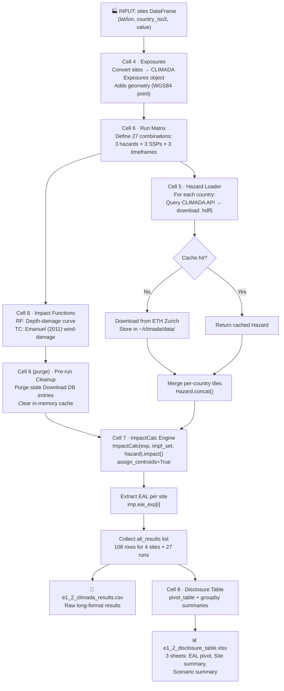

# ESRS E1-2 Climate Physical-Risk Assessment — `load_exposure.ipynb`

> **Audience:** Beginners to climate risk modelling and the CLIMADA framework.
> No prior knowledge of Python beyond running a Jupyter notebook is assumed.

---

## Table of Contents

1. [STAR Overview](#1-star-overview)
2. [Prerequisites & Setup](#2-prerequisites--setup)
3. [How to Run](#3-how-to-run)
4. [Architecture: The 3-Layer Risk Equation](#4-architecture-the-3-layer-risk-equation)
5. [Flowchart](#5-flowchart)
6. [Data Lineage](#6-data-lineage)
7. [Cell-by-Cell Walkthrough](#7-cell-by-cell-walkthrough)
8. [Data Dictionaries](#8-data-dictionaries)
9. [Key Terms & Acronyms Glossary](#9-key-terms--acronyms-glossary)
10. [Known Limitations & Audit Disclosures](#10-known-limitations--audit-disclosures)
11. [ESRS E1-2 Datapoint Mapping](#11-esrs-e1-2-datapoint-mapping)

---

## 1. STAR Overview

### Situation

European companies with global operations must now disclose how physical climate hazards —
floods, storms, extreme rainfall — threaten their assets. This is mandated by **ESRS E1-2**
(European Sustainability Reporting Standard, Environment Topic 1, Disclosure 2), part of the
EU Corporate Sustainability Reporting Directive (CSRD).

**The problem:** Traditional qualitative risk assessments ("we are near a river, so flood
risk is High") are no longer sufficient. Auditors and regulators expect a quantified,
scenario-based, probabilistic analysis backed by a credible methodology.

> **Analogy:** Think of your home insurance. The insurer does not just say "you live near
> the coast, so risk is high." They calculate the *exact probability* of flooding at your
> address, the *likely damage* to your home, and charge you a *precise premium*. ESRS E1-2
> asks companies to do the same calculation for all their sites, across three future climate
> futures.

---

### Task

Produce an **Expected Annual Loss (EAL)** — expressed as a fraction of asset value — for
every company site, under every combination of:

- **3 hazards**: River Flooding, Extreme Precipitation, Tropical Storms
- **3 climate scenarios**: Low-emission future, Mid-emission future, High-emission future
- **3 time horizons**: Near-term (0–3 yr), Medium-term (3–10 yr), Long-term (10+ yr)

That is **27 combinations per site**. The result must be audit-ready: traceable back to
peer-reviewed methodology, open data, and documented assumptions.

---

### Action

The notebook uses **CLIMADA** (CLIMate ADAptation), an open-source Python library developed
by ETH Zurich and used by EIOPA (the EU insurance regulator) for stress-testing. CLIMADA
provides:

1. A **Data API** that streams open-access, country-level hazard event sets (no manual
   data wrangling required).
2. A **probabilistic risk engine** that applies the fundamental risk equation:

   ```
   Risk = Hazard × Exposure × Vulnerability
   ```

3. **Expected Annual Loss** as the output metric — the average loss you would expect over
   many years, accounting for the full range of event probabilities and severities.

The notebook fetches hazard data per country, assigns vulnerability curves, runs
`ImpactCalc`, and writes the results to a pivot-table Excel workbook ready for insertion
into the sustainability report.

---

### Result

| Output file | Contents |
|---|---|
| `e1_2_climada_results.csv` | Raw results: one row per site × hazard × scenario × timeframe (108 rows for 4 sites) |
| `e1_2_disclosure_table.xlsx` | Three audit-facing sheets: EAL pivot by site+hazard, site-level summary, scenario summary |

The EAL values are dimensionless fractions of asset value (e.g., `0.001250` = 0.125% annual
damage). Multiply by actual asset replacement cost to convert to a currency figure.

---

## 2. Prerequisites & Setup

### Software

| Requirement | Version | Notes |
|---|---|---|
| Python | 3.11 | Via conda environment `climada_env_3.11` |
| CLIMADA | 6.1.0 | `pip install climada` or `conda install climada` |
| pandas | any recent | Included with CLIMADA deps |
| numpy | any recent | Included with CLIMADA deps |
| openpyxl | any recent | Required for `.xlsx` output |

> **CLIMADA Petals is NOT required.** This notebook uses only the core `climada` package.
> European windstorm (extratropical) risk would need `climada_petals` (`StormEurope`), but
> that is out of scope here.

### Internet Access

The notebook downloads hazard files from the **CLIMADA Data API** hosted at ETH Zurich
(`data.iac.ethz.ch`). Files range from ~5 MB (small country, tropical cyclone) to
~130 MB (large country, tropical cyclone). A stable connection is recommended.

Files are cached locally after the first download at:

```
~/climada/data/
  hazard/
    river_flood/        ← flood + extreme precip tiles
    tropical_cyclone/   ← storm track event sets
```

Subsequent runs skip the download and load directly from the local cache.

### Input You Must Supply

The only thing you need to change is the `sites` DataFrame in **Cell 4**:

```python
sites = pd.DataFrame({
    'site_name': [...],   # human-readable label
    'latitude':  [...],   # WGS84 decimal degrees
    'longitude': [...],
    'country_iso3': [...] # 3-letter ISO country code (e.g. 'PHL', 'GBR')
})
```

Everything else (hazard download, vulnerability curves, impact calculation) runs automatically.

---

## 3. How to Run

```bash
# 1. Activate the environment
conda activate climada_env_3.11

# 2. Launch Jupyter
jupyter notebook load_exposure.ipynb

# 3. Run all cells in order:
#    Kernel → Restart & Run All
```

**First run:** Expect 30–90 minutes due to hazard file downloads (especially tropical
cyclone files which can be 100+ MB each). Subsequent runs use the local cache and complete
in ~5 minutes.

---

## 4. Architecture: The 3-Layer Risk Equation

```
Risk = Hazard × Exposure × Vulnerability
```

Think of it like baking a cake. You need three ingredients — missing any one means no cake.

| Layer | What it means | Analogy | In this notebook |
|---|---|---|---|
| **Hazard** | The dangerous event itself — how often it happens, how intense | The storm or flood | Downloaded from CLIMADA API (river flood maps, cyclone tracks) |
| **Exposure** | What is in the path of danger | Your house, staff, equipment | The `sites` DataFrame — your company locations |
| **Vulnerability** | How easily things are damaged given the hazard intensity | How well-built your house is | Impact functions (`impf_RF`, `impf_TC`) |

**Expected Annual Loss (EAL)** is what comes out of multiplying all three together and
averaging across all possible events in a year.

> **Insurance analogy:** The EAL is like the "pure risk premium" in an insurance policy —
> the average amount you'd expect to pay out each year before any profit margin. If your
> house has an EAL of 0.2% of its value, and it's worth $500,000, you'd expect ~$1,000
> average annual loss from that hazard.

---

## 5. Flowchart



> If your Markdown viewer does not render Mermaid diagrams, paste the code block at
> [mermaid.live](https://mermaid.live) to view it.

### Plain-English Walkthrough of the Flowchart

1. You provide site locations (latitude/longitude/country).
2. The notebook converts them into a CLIMADA `Exposures` object (adds GPS geometry).
3. A 27-combination run matrix is defined (3 hazards × 3 scenarios × 3 timeframes).
4. Vulnerability curves (impact functions) are built for flood and storm hazards.
5. Before the main loop, stale download locks are cleared from the cache database.
6. For each of the 27 combinations, hazard data is fetched per country (or reused from
   cache), merged into a single event set, then fed to `ImpactCalc`.
7. `ImpactCalc` produces the EAL per site. Results accumulate in `all_results`.
8. After all 27 runs, a pivot table and two summary tables are written to Excel.

---

## 6. Data Lineage

Data lineage answers: **"Where did each number come from, and what touched it on the way?"**

```
┌─────────────────────────────────────────────────────────────────────────────┐
│  EXTERNAL SOURCES                                                           │
│                                                                             │
│  ETH Zurich CLIMADA Data API (data.iac.ethz.ch)                            │
│    ├── GloFAS/ISIMIP river-flood depth maps  →  river_flood_*.hdf5         │
│    └── IBTrACS synthetic TC tracks (CMIP6-scaled)  →  tropical_cyclone_*.hdf5 │
└───────────────────────────────────────┬─────────────────────────────────────┘
                                        │ downloaded by Client.get_hazard()
                                        │ cached in ~/climada/data/
                                        ▼
┌─────────────────────────────────────────────────────────────────────────────┐
│  NOTEBOOK INPUTS (you provide)                                              │
│                                                                             │
│  sites DataFrame                                                            │
│    site_name, latitude, longitude, country_iso3,                           │
│    value (default 1.0), headcount, business_area, criticality,             │
│    impf_RF, impf_TC                                                        │
└───────────────────────────────────────┬─────────────────────────────────────┘
                                        │ Exposures(sites)
                                        ▼
                               exp  (Exposures object)
                               exp.gdf  (GeoDataFrame with geometry)
                                        │
                   ┌────────────────────┼──────────────────────┐
                   │                    │                       │
                   ▼                    ▼                       ▼
            impf_sets['RF']      Hazard object           impf_sets['TC']
            (depth-damage)       (merged per-country     (Emanuel wind-damage)
                   │              event set)                    │
                   └────────────────────┼──────────────────────┘
                                        │ ImpactCalc(exp, impf_set, hazard).impact()
                                        ▼
                               imp.eai_exp  [array, one value per site]
                               = Expected Annual Loss fraction
                                        │
                                        ▼
                            all_results  (list of dicts)
                            One entry per site × hazard × scenario × timeframe
                            = 4 sites × 27 combinations = 108 rows
                                        │
                          ┌─────────────┴──────────────┐
                          ▼                            ▼
              e1_2_climada_results.csv      results_df  (DataFrame)
              (long-format raw results)               │
                                           ┌──────────┼────────────┐
                                           ▼          ▼            ▼
                                         pivot   site_summary  scenario_summary
                                           │          │            │
                                           └──────────┴────────────┘
                                                      │
                                                      ▼
                                       e1_2_disclosure_table.xlsx
                                       (3 sheets, audit-ready)
```

---

## 7. Cell-by-Cell Walkthrough

### Cell 1 · Imports

```python
import pandas as pd
import numpy as np
from climada.entity import Exposures, ImpactFuncSet, ImpactFunc, ImpfTropCyclone
from climada.hazard import Hazard
from climada.engine import ImpactCalc
from climada.util.api_client import Client
```

**What this does:** Loads all the libraries the notebook depends on.

| Import | Purpose |
|---|---|
| `pandas` | Table (DataFrame) operations — reading, filtering, pivoting results |
| `numpy` | Numerical arrays — used to define vulnerability curve data points |
| `Exposures` | CLIMADA class that wraps your site locations as a GIS-aware table |
| `ImpactFuncSet` | Container that holds one or more vulnerability curves |
| `ImpactFunc` | A single vulnerability curve (e.g., flood depth → damage fraction) |
| `ImpfTropCyclone` | Pre-built tropical cyclone vulnerability curve (Emanuel 2011) |
| `Hazard` | CLIMADA class that holds a probabilistic event set (thousands of flood/storm scenarios) |
| `ImpactCalc` | The risk engine: takes Exposures + ImpactFuncSet + Hazard → computes losses |
| `Client` | CLIMADA's API client for downloading hazard datasets from ETH Zurich |

---

### Cell 2 · Imports (Section Header — markdown only)

No code. Just the "Section 1 · Imports" heading.

---

### Cell 3 · Markdown Explanation (Section 2 header — markdown only)

Explains what "exposure" means and why `value = 1.0` is used as a default.

---

### Cell 4 · Load the Exposure (`sites` DataFrame + `Exposures` object)

```python
sites = pd.DataFrame({ ... })
exp = Exposures(sites)
exp.check()
exp.gdf.head()
```

**What this does:** Defines your company's sites and wraps them in a CLIMADA `Exposures`
object. This is the **only cell you need to edit** to use the notebook for your own company.

**Output:** A GeoDataFrame (`exp.gdf`) — a regular table enhanced with a `geometry` column
that stores the GPS location as a point, enabling spatial matching with hazard grids.

> **Analogy:** Imagine plotting your offices on Google Maps. The `Exposures` object is
> exactly that map — each pin is a site with its details attached.

**What `exp.check()` does:** Validates that the Exposures object is internally consistent
(all required columns present, no missing coordinates, impact-function IDs are integers, etc.).
It raises an error early rather than letting problems surface later during the risk calculation.

**What `exp.gdf` is:** `gdf` stands for *GeoDataFrame* (from the `geopandas` library).
It is your `sites` table with an extra `geometry` column added automatically by CLIMADA.

---

### Cell 5 · Define the 27-Run Matrix (`scenarios` + `hazard_config`)

```python
scenarios = {
    'SSP1-1.9': 'rcp26',
    'SSP2-4.5': 'rcp60',
    'SSP3-7.0': 'rcp85',
}
hazard_config = { ... }
COUNTRIES = sites['country_iso3'].unique().tolist()
```

**What this does:** Defines the full matrix of what will be computed. Think of it as the
"menu" — 27 dishes, each a unique combination of hazard + scenario + timeframe.

#### `scenarios` dictionary

Maps ESRS-standard scenario names (SSP labels) to the RCP codes used by the CLIMADA API.

| SSP Label | Warming | RCP Code | Plain English |
|---|---|---|---|
| SSP1-1.9 | ~+1.5 °C | `rcp26` | Best case — strong global climate action |
| SSP2-4.5 | ~+2.7 °C | `rcp60` | Middle road — some action, some delay |
| SSP3-7.0 | ~+3.6 °C | `rcp85` | Worst case — business as usual |

> **Why is SSP2-4.5 mapped to rcp60 and not rcp45?** The CLIMADA river-flood dataset does
> not have an `rcp45` tile. Using `rcp60` for both hazards keeps the scenario consistent.
> This substitution must be disclosed in the audit narrative.

#### `hazard_config` dictionary

Each key (`'Flooding'`, `'Extreme Precip.'`, `'Storms'`) maps to a sub-dictionary with:

| Key | Type | Purpose |
|---|---|---|
| `haz_type` | string | CLIMADA API hazard type identifier (`'river_flood'` or `'tropical_cyclone'`) |
| `tag` | string | Short code matching the impact function (`'RF'` or `'TC'`) |
| `impf_col` | string | Column in `sites` DataFrame that links each site to its vulnerability curve ID |
| `time_prop` | string | API property name for the time dimension (`'year_range'` or `'ref_year'`) |
| `timeframes` | dict | Maps ESRS horizon label → API time value |
| `extra_props` | dict | Additional API filters; `model_name='random_walk'` selects the correct TC dataset |

#### Time dimension mapping

The two hazard types express time differently in the API:

| Hazard | Time property | Values | Meaning |
|---|---|---|---|
| River flood | `year_range` | `'2010_2030'`, `'2030_2050'`, `'2050_2070'` | A 20-year window average |
| Tropical cyclone | `ref_year` | `'2040'`, `'2060'`, `'2080'` | A snapshot at that year |

> **Analogy:** The flood data is like a 20-year average temperature — it smooths out
> year-to-year noise. The cyclone data is like a photograph taken at a specific year —
> it captures conditions at that exact point in time.

#### `COUNTRIES`

A deduplicated list of ISO3 country codes from the `sites` table. The hazard loader uses
this to download one tile per country and merge them into a single event set.

---

### Cell 6 · Markdown (Section 3 header — markdown only)

No code. Explains scenarios and time-horizon mapping in narrative form.

---

### Cell 7 · Markdown (Section 4 header — markdown only)

No code. Introduces impact functions.

---

### Cell 8 · Build the Impact (Vulnerability) Functions

```python
impf_tc = ImpfTropCyclone.from_emanuel_usa()
impf_rf = ImpactFunc(id=1, haz_type='RF', ...)
impf_sets = {'RF': ImpactFuncSet([impf_rf]), 'TC': ImpactFuncSet([impf_tc])}
```

**What this does:** Defines how damage grows with hazard intensity.

> **Analogy:** Think of a car crash test. Engineers have tables that say "at 30 km/h,
> damage is 10%; at 60 km/h, damage is 40%; at 100 km/h, damage is 90%." Impact functions
> are the same idea — a lookup table mapping intensity to damage fraction.

#### Tropical Cyclone Function — `ImpfTropCyclone.from_emanuel_usa()`

Uses the **Emanuel (2011)** calibration, a peer-reviewed formula derived from Atlantic
hurricane loss records. It maps **maximum sustained wind speed (m/s)** to a damage fraction
between 0 and 1.

| Parameter | Value |
|---|---|
| `haz_type` | `'TC'` |
| `id` | `1` (links to `impf_TC=1` in the `sites` table) |
| Intensity unit | m/s (wind speed) |
| Damage at 0 m/s | 0 |
| Damage at ~70 m/s | ~1.0 (total loss) |

#### River Flood Function — `ImpactFunc(...)`

A **JRC-style depth-damage curve** mapping flood water depth (metres) to damage fraction.

| Depth (m) | Damage fraction (MDD) | Meaning |
|---|---|---|
| 0.0 | 0.00 | Dry — no damage |
| 0.5 | 0.15 | Ankle-deep — minor damage |
| 1.0 | 0.30 | Knee-deep — significant damage |
| 1.5 | 0.45 | Waist-deep — heavy damage |
| 2.0 | 0.55 | Above waist — major damage |
| 3.0 | 0.70 | — |
| 5.0 | 0.85 | — |
| 10.0 | 1.00 | Fully submerged — total loss |

**`ImpactFunc` parameters explained:**

| Parameter | Description |
|---|---|
| `id` | Integer identifier. Must match the `impf_RF` column in `sites`. |
| `haz_type` | Must be `'RF'` — matches the river_flood API tag. Note: NOT `'FL'`. |
| `name` | Human-readable label (not used in calculations). |
| `intensity` | Array of hazard intensity values (flood depth in metres). |
| `mdd` | **Mean Damage Degree** — fraction of asset value damaged (0–1). |
| `paa` | **Percentage of Assets Affected** — what fraction of assets at the site are exposed. Set to 1 (all assets) here. |
| `intensity_unit` | Unit label for the intensity axis. |

#### `impf_sets` dictionary

Groups impact functions by their hazard tag. `ImpactCalc` selects the right set per run
using `cfg['tag']` (`'RF'` or `'TC'`).

---

### Cell 9 · Markdown (Section 5 header — markdown only)

No code. Explains caching and graceful gap handling.

---

### Cell 10 · Hazard Loader (`load_hazard` function)

```python
import time
from climada.util.api_client import Download

client = Client()
_hazard_cache = {}

def load_hazard(cfg, rcp_code, time_value): ...
```

**What this does:** Defines the function that downloads (or retrieves from cache) one
merged hazard event set covering all countries in `COUNTRIES`.

#### `client = Client()`

Creates a CLIMADA API client instance. This is the object that communicates with
`data.iac.ethz.ch` to list and download datasets.

#### `_hazard_cache = {}`

A Python dictionary that stores previously fetched `Hazard` objects in memory. If the same
`(haz_type, rcp_code, time_value)` combination is requested again, it is returned
immediately without a network call.

> **Why is this important?** `Flooding` and `Extreme Precip.` both use `river_flood` data.
> Without caching, the same large files would be downloaded twice per scenario-timeframe pair.

#### `load_hazard(cfg, rcp_code, time_value)` — function signature

| Parameter | Type | Description |
|---|---|---|
| `cfg` | dict | One entry from `hazard_config` (e.g., the `'Storms'` sub-dict) |
| `rcp_code` | string | RCP scenario string from `scenarios` (e.g., `'rcp26'`) |
| `time_value` | string | API time value (e.g., `'2010_2030'` or `'2040'`) |

**Returns:** A merged `Hazard` object covering all countries, or `None` if no data exists.

#### Inside the function — `props` dictionary

```python
props = {
    'country_iso3alpha': iso3,
    'climate_scenario': rcp_code,
    cfg['time_prop']: time_value,
    **cfg['extra_props'],
}
```

This is the query sent to the CLIMADA API. Each key is a metadata filter:

| API Property | Example Value | Purpose |
|---|---|---|
| `country_iso3alpha` | `'PHL'` | Selects the per-country hazard tile |
| `climate_scenario` | `'rcp26'` | Filters to the chosen emissions pathway |
| `year_range` | `'2010_2030'` | (Flood only) Selects the 20-year window |
| `ref_year` | `'2040'` | (TC only) Selects the reference year snapshot |
| `model_name` | `'random_walk'` | (TC only) Selects the synthetic-track dataset |

#### Retry logic

```python
for attempt in range(2):
    try:
        parts.append(client.get_hazard(...))
        break
    except Exception as exc:
        exc_name = type(exc).__name__
        if exc_name in ('ChunkedEncodingError', 'Failed') and attempt == 0:
            # purge stale DB entries, sleep 5s, retry once
        else:
            print(f"    - no {cfg['haz_type']} for {iso3} ...")
            break
```

| Exception | Cause | Action |
|---|---|---|
| `ChunkedEncodingError` | Network connection dropped mid-download | Purge stale DB lock, sleep 5 s, retry once |
| `Failed` | A previous download was interrupted, leaving a stale cache DB entry | Same — purge and retry |
| `NoResult` | No dataset exists in the API for this combination (e.g., rcp85 + 2080 for TC) | Log and skip; EAL recorded as NaN |
| Any other | Unexpected error | Log and skip |

#### `Hazard.concat(parts)`

Merges individual per-country `Hazard` objects into a single combined event set that covers
all sites. Each country tile has its own geographic footprint; concatenation combines them
so the `ImpactCalc` engine can find the nearest event for any site, regardless of country.

---

### Cell 11 · Markdown (Section 6 header — markdown only)

No code. Explains the 27-run engine.

---

### Cell 885fc7ff · Pre-Run Cache Purge

```python
from pathlib import Path
from climada.util.api_client import Download

for _d in list(Download.select()):
    if _d.enddownload is None and _tc_haz_type in _d.path:
        _d.delete_instance()
```

**What this does:** Before starting the 27-run loop, clears any stale entries from the
CLIMADA download-tracking SQLite database.

> **Analogy:** Before checking books out of a library, you return any items that were
> signed out but never actually borrowed (maybe the librarian marked them as "in transit"
> but they never left). Without this step, the library refuses to let you borrow them again.

#### What is the `Download` table?

CLIMADA uses a local SQLite database to track file downloads. Each row represents one
file download attempt with these fields:

| Field | Description |
|---|---|
| `id` | Auto-increment primary key |
| `url` | The remote URL of the file |
| `path` | The absolute local path where the file is/was being saved |
| `startdownload` | Timestamp when the download began |
| `enddownload` | Timestamp when the download completed (`NULL` if still in progress or interrupted) |

A **stale entry** is any row where `enddownload IS NULL`. These are left behind when a
download is interrupted (power cut, network drop, kernel restart).

#### Why query the DB instead of using `glob`?

A `glob` scan only finds files that *exist on disk*. But a download can be interrupted
*before any data is written* — the file never appears on disk, yet the DB entry blocks
the next attempt. Querying `Download.select()` directly catches all stale entries regardless
of whether a file exists.

---

### Cell 12 (449f82bc) · The 27-Run Engine (main loop)

```python
for haz_name, cfg in hazard_config.items():
    for ssp_name, rcp_code in scenarios.items():
        for tf_name, tf_value in cfg['timeframes'].items():
            hazard = load_hazard(cfg, rcp_code, tf_value)
            imp = ImpactCalc(exp, impf_sets[cfg['tag']], hazard).impact(
                save_mat=False, assign_centroids=True)
            for i, name in enumerate(sites['site_name']):
                eal_by_site[name] = float(imp.eai_exp[i])
```

**What this does:** The core of the notebook. Iterates all 27 combinations and computes
EAL for each site.

#### `ImpactCalc(exp, impf_sets[cfg['tag']], hazard)`

Creates an impact calculator by combining the three risk layers:

| Argument | What it represents |
|---|---|
| `exp` | Exposure — your sites |
| `impf_sets[cfg['tag']]` | Vulnerability — the flood or cyclone damage curve |
| `hazard` | Hazard — the downloaded event set |

#### `.impact(save_mat=False, assign_centroids=True)`

Runs the risk calculation. Two parameters:

| Parameter | Value | Meaning |
|---|---|---|
| `save_mat` | `False` | Do not save the full loss matrix (saves memory — we only need the final EAL) |
| `assign_centroids` | `True` | Automatically find the nearest hazard grid point for each site |

> **What is a centroid?** The hazard grid (e.g., flood map) is divided into cells. Each
> cell has a centre point called a centroid. `assign_centroids=True` tells CLIMADA to match
> each site to the nearest centroid — like snapping your GPS pin to the nearest weather
> station.

#### `imp.eai_exp`

A NumPy array with one element per site (in the same order as `exp.gdf`). Each value is
the **Expected Annual Loss** for that site, expressed as a fraction of `value`.

> **Example:** If `imp.eai_exp[0] = 0.001250`, the Manila Warehouse has a 0.125% expected
> annual damage rate. With `value = 1.0` (the default), this is already the damage fraction.
> If Manila WH has a replacement cost of ₱50M, the expected annual loss is ₱50M × 0.00125
> = ₱62,500 per year on average.

#### `all_results` list

After each of the 27 runs, one dictionary is appended per site. This is the "ledger" that
accumulates every result before being converted to a DataFrame.

#### Progress indicator

```
[ 1/27] Flooding | SSP1-1.9 | Short (0-3yr)
```

Shows which of the 27 combinations is running. If a country has no data for a combination,
a note is printed:

```
    - no tropical_cyclone for GBR (rcp85, 2080): NoResult
```

This is expected for some combinations (e.g., rcp85+2080 TC data does not exist in the
CLIMADA API at time of writing).

---

### Cell 13 · Markdown (Section 7 header — markdown only)

No code. Explains the disclosure table structure.

---

### Cell 14 (cell-15) · Generate the E1-2 Disclosure Table

```python
pivot = results_df.pivot_table(...)
site_summary = results_df.groupby('site_name').agg(...)
scenario_summary = results_df.groupby(['scenario', 'timeframe']).agg(...)
with pd.ExcelWriter('e1_2_disclosure_table.xlsx') as xl: ...
```

**What this does:** Transforms the raw 108-row results into three audit-facing views and
writes them to Excel.

#### `pivot_table`

Reshapes the long-format results into a wide table. Each row is one site+hazard combination;
each column is one scenario+timeframe pair.

> **Analogy:** Like a school report card. Rows are subjects (site + hazard), columns are
> exams (scenario × timeframe), and each cell is the grade (EAL).

#### `site_summary`

Groups by `site_name` to produce a single row per site with aggregated metrics. Used to
identify which sites face the most risk overall.

#### `scenario_summary`

Groups by `scenario` and `timeframe` to show how total portfolio risk grows across the
climate pathway. Used to answer "does our risk get worse under high-emissions futures?"

---

### Cell 15 · ESRS Mapping Table (markdown only)

No code. Provides a paragraph-by-paragraph mapping of notebook outputs to the ESRS E1-2
disclosure requirements (§14, §15, §16, AR6). Use this section when drafting the
sustainability report narrative.

---

## 8. Data Dictionaries

### 8.1 Input: `sites` DataFrame

The only data you must supply. All columns except `latitude`, `longitude`, and `country_iso3`
have defaults or can be omitted if not yet known.

| Column | Type | Required | Example | Description |
|---|---|---|---|---|
| `site_name` | string | Yes | `'Manila WH'` | Human-readable site identifier. Carries through to all outputs. |
| `latitude` | float | Yes | `14.5995` | WGS84 decimal degrees. North is positive. |
| `longitude` | float | Yes | `120.9842` | WGS84 decimal degrees. East is positive. |
| `country_iso3` | string | Yes | `'PHL'` | ISO 3166-1 alpha-3 country code. Used to select the correct hazard tile from the API. |
| `value` | float | No (default 1.0) | `1.0` | Asset replacement value in your chosen currency. With `1.0`, EAL is a fraction. Replace with actual cost to get monetary EAL. |
| `headcount` | int | No | `120` | Number of employees at the site. Used in the E1-2 sensitivity narrative (AR 6(b)). Not used in risk math. |
| `business_area` | string | No | `'Logistics'` | Business function of the site. Enrichment only. |
| `criticality` | string | No | `'High'` | Operational criticality level. Enrichment only. |
| `impf_RF` | int | Yes | `1` | ID of the river-flood impact function to apply. Must match an `id` in `impf_sets['RF']`. |
| `impf_TC` | int | Yes | `1` | ID of the tropical-cyclone impact function. Must match an `id` in `impf_sets['TC']`. |

---

### 8.2 `exp.gdf` — The Exposures GeoDataFrame

Output of `Exposures(sites)`. Identical to `sites` plus one extra column added by CLIMADA:

| Column | Type | Description |
|---|---|---|
| *(all columns from `sites`)* | — | Carried through unchanged |
| `geometry` | shapely Point | GPS location as a point geometry: `POINT (longitude latitude)` |

---

### 8.3 `results_df` / `e1_2_climada_results.csv` — Raw Results

108 rows (4 sites × 27 combinations). One row per site per run.

| Column | Type | Example | Description |
|---|---|---|---|
| `site_name` | string | `'Manila WH'` | Site identifier |
| `latitude` | float | `14.5995` | WGS84 latitude |
| `longitude` | float | `120.9842` | WGS84 longitude |
| `country_iso3` | string | `'PHL'` | ISO3 country code |
| `headcount` | int | `120` | From input `sites` |
| `business_area` | string | `'Logistics'` | From input `sites` |
| `criticality` | string | `'High'` | From input `sites` |
| `hazard` | string | `'Flooding'` | One of: `'Flooding'`, `'Extreme Precip.'`, `'Storms'` |
| `scenario` | string | `'SSP1-1.9'` | One of: `'SSP1-1.9'`, `'SSP2-4.5'`, `'SSP3-7.0'` |
| `timeframe` | string | `'Short (0-3yr)'` | One of: `'Short (0-3yr)'`, `'Medium (3-10yr)'`, `'Long (10+yr)'` |
| `eal` | float or NaN | `0.001250` | Expected Annual Loss as a fraction of `value`. `NaN` = no API data for this combination. |

---

### 8.4 `e1_2_disclosure_table.xlsx` — Sheet: `EAL_by_site_hazard`

The main audit artefact. A pivot table.

**Rows (index):** Each unique `(site_name, business_area, criticality, headcount, hazard)` combination.

**Columns (multi-level header):**

```
scenario      SSP1-1.9                    SSP2-4.5                    SSP3-7.0
timeframe     Short  Medium  Long         Short  Medium  Long         Short  Medium  Long
```

**Cell values:** EAL as a fraction of asset value for that site/hazard/scenario/timeframe.
`NaN` = no data available from the API.

---

### 8.5 `e1_2_disclosure_table.xlsx` — Sheet: `Site_summary`

One row per site, sorted by `total_eal` descending (most exposed first).

| Column | Description |
|---|---|
| `site_name` | Site identifier (index) |
| `total_eal` | Sum of EAL across all 27 combinations. Higher = more exposed overall. |
| `peak_hazard_eal` | Maximum single-combination EAL. Identifies the worst-case hazard+scenario+timeframe. |
| `headcount` | Number of employees (from input). |
| `criticality` | Operational criticality (from input). |

---

### 8.6 `e1_2_disclosure_table.xlsx` — Sheet: `Scenario_summary`

One row per scenario+timeframe combination (9 rows). Shows portfolio-wide risk trajectory.

| Column | Description |
|---|---|
| `scenario` | SSP scenario label |
| `timeframe` | Time horizon label |
| `total_eal` | Sum of EAL across all sites and all hazards for this combination. |
| `max_site_eal` | Highest single-site EAL in this combination. |
| `sites_at_risk` | Count of site+hazard rows where `eal > 0`. |

---

## 9. Key Terms & Acronyms Glossary

| Term | Full Name | Plain-English Explanation |
|---|---|---|
| **CLIMADA** | CLIMate ADAptation | Open-source risk modelling platform from ETH Zurich. It is the "engine" running all calculations. |
| **CSRD** | Corporate Sustainability Reporting Directive | EU law requiring large companies to report sustainability data, including climate risks. |
| **ESRS** | European Sustainability Reporting Standards | The specific reporting templates under CSRD. **E1-2** covers physical climate risk identification. |
| **EFRAG** | European Financial Reporting Advisory Group | The EU body that writes the ESRS standards. |
| **SSP** | Shared Socioeconomic Pathway | A set of five storylines describing how society and emissions might develop. SSP1 = sustainability; SSP3 = rivalry and high emissions. |
| **RCP** | Representative Concentration Pathway | An older (CMIP5) set of emissions pathways indexed by radiative forcing (watts/m²). The CLIMADA API uses RCP codes. SSPs are mapped to RCPs for data access. |
| **EAL** | Expected Annual Loss | The average loss you would expect per year if you could replay many years. Like an insurance premium. Expressed here as a fraction of asset value. |
| **Hazard** | — | The physical danger: flood water, wind speed, rainfall. In CLIMADA, a `Hazard` object holds thousands of simulated events and their probabilities. |
| **Exposure** | — | What is at risk: buildings, people, equipment. In CLIMADA, the `Exposures` object holds your site locations and values. |
| **Vulnerability** | — | How easily assets are damaged at a given hazard intensity. Encoded as an impact function (damage curve). |
| **Impact Function** | — | A lookup table mapping hazard intensity (e.g., flood depth in metres) to damage fraction (0–1). |
| **MDD** | Mean Damage Degree | The fraction of an asset's value that is damaged at a given intensity. Component of the impact function. |
| **PAA** | Percentage of Assets Affected | The fraction of assets at a site that are exposed to the hazard at all. Usually 1 (100%). Component of the impact function. |
| **haz_type** | Hazard Type | CLIMADA's internal code for a hazard family: `'river_flood'`, `'tropical_cyclone'`, etc. |
| **RF** | River Flood | Short tag used in CLIMADA for river-flood and extreme-precipitation hazard functions and exposure columns. |
| **TC** | Tropical Cyclone | Short tag used in CLIMADA for tropical cyclone hazard functions and exposure columns. |
| **Centroid** | — | The centre point of a hazard grid cell. `assign_centroids=True` snaps each site to the nearest centroid so the correct hazard intensity is used. |
| **IBTrACS** | International Best Track Archive for Climate Stewardship | The global historical tropical cyclone database used to calibrate CLIMADA's synthetic storm tracks. |
| **ISIMIP** | Inter-Sectoral Impact Model Intercomparison Project | The scientific project that produced the global river-flood hazard maps used in the CLIMADA API. |
| **GloFAS** | Global Flood Awareness System | The EU's operational flood forecasting platform; its hydrological model underpins the ISIMIP flood maps. |
| **CMIP6** | Coupled Model Intercomparison Project Phase 6 | The collection of global climate model runs used to scale future hazard intensities. |
| **WGS84** | World Geodetic System 1984 | The GPS coordinate standard. Latitude/longitude decimals in this notebook are WGS84. |
| **ISO3** | ISO 3166-1 alpha-3 | Three-letter country codes (e.g., `PHL` = Philippines, `GBR` = United Kingdom). |
| **HDF5** | Hierarchical Data Format v5 | The binary file format used by CLIMADA to store hazard event sets. Files end in `.hdf5`. |
| **API** | Application Programming Interface | A way to request data from a remote server programmatically. CLIMADA's API at ETH Zurich serves hazard datasets on demand. |
| **Cache** | — | A local copy of downloaded files so they don't need to be re-downloaded on each run. CLIMADA caches files in `~/climada/data/`. |
| **SYSTEM_DIR** | — | CLIMADA's default local storage directory, resolved from the user's home folder (`~/climada/data`). Portable across machines. |
| **`ImpactCalc`** | — | CLIMADA 6.x class for running the risk calculation. Replaced the deprecated `Impact.calc()` method from older versions. |
| **`eai_exp`** | Expected Annual Impact per Exposure | The output array from `ImpactCalc.impact()`. One float per site. Each value is the EAL for that site. |
| **Synthetic tracks** | — | Simulated storm paths generated by perturbing historical tracks with random-walk physics. CLIMADA uses 10,000 synthetic tracks per scenario to build a statistically robust event set. |
| **random_walk** | — | The CLIMADA synthetic track generation model name used to select the correct tropical cyclone dataset from the API. |
| **`NoResult`** | — | Exception raised by the CLIMADA API client when no dataset matches the requested query parameters (e.g., a country+scenario+year combination with no published data). |
| **`ChunkedEncodingError`** | — | Python `requests` library exception indicating the network connection was dropped in the middle of a file download. |
| **Pivot table** | — | A table that summarises data by rotating (pivoting) rows into columns. Used here to create the disclosure table with scenarios as columns. |
| **GeoDataFrame** | — | A pandas DataFrame with an additional column storing geographic shapes or points (from the `geopandas` library). |
| **EIOPA** | European Insurance and Occupational Pensions Authority | The EU insurance regulator. Uses CLIMADA for climate stress-testing. Citing EIOPA's use of CLIMADA strengthens audit defensibility. |

---

## 10. Known Limitations & Audit Disclosures

State these explicitly in the E1-2 narrative for audit defensibility.

### 1. Extreme Precipitation = River Flood (same dataset)

`Extreme Precip.` uses the same CLIMADA river-flood dataset as `Flooding`. The standard
CLIMADA approach treats extreme precipitation risk as expressed through its flooding impact.
EAL values for these two hazards will be identical per site. Disclose this in the methodology
section.

### 2. European Sites Have No Tropical Cyclone Data

London (GBR) and Paris (FRA) are outside tropical cyclone basins. The CLIMADA open-access TC
dataset covers typhoon/hurricane basins only. European **windstorm** risk (extratropical)
requires the `climada_petals` package (`StormEurope` module) — a separate exercise.

### 3. SSP Proxy Substitutions

| ESRS Scenario | True RCP Proxy | Substitution | Reason |
|---|---|---|---|
| SSP1-1.9 | SSP1-2.6 | Using `rcp26` | Closest available; ~0.3 °C difference from 1.9 |
| SSP2-4.5 | `rcp45` | Using `rcp60` | `rcp45` absent from flood dataset |

Both substitutions are conservative (slightly higher warming than intended) and must be
documented.

### 4. `rcp85` + 2080 TC Data Does Not Exist

The CLIMADA API does not publish tropical cyclone data for the `rcp85` + `ref_year=2080`
combination at time of writing. The `Long (10+yr)` horizon under `SSP3-7.0` for Storms
returns `NaN`. This is noted in the results with a `NoResult` message and must be disclosed.

### 5. Unit Asset Values

With `value = 1.0`, EAL is a **damage fraction** (dimensionless). To produce monetary EAL
for the report, multiply by the actual asset replacement cost:

```
EAL (currency) = EAL (fraction) × replacement_cost
```

Example: EAL = 0.00125 × $500,000 replacement cost = $625/year expected annual loss.

### 6. Centroid Distance Warning

The CLIMADA log may print:

```
WARNING - Distance to closest centroid is greater than 0.083333 degree
```

This means one site is more than ~9 km from the nearest hazard grid point. The assigned
intensity may be slightly inaccurate. For high-precision work, check which site triggers
this warning and consider whether the grid resolution is adequate.

---

## 11. ESRS E1-2 Datapoint Mapping

| Paragraph | Requirement | Satisfied by |
|---|---|---|
| §14 | Classify risks as physical or transition | `hazard` column — all three are physical risks |
| §15(a) | Methodology for exposure assessment | CLIMADA (ETH Zurich, peer-reviewed, EIOPA-adopted) + this notebook |
| §15(b) | Transition risk events and trends | **Out of scope** — CLIMADA is physical-risk only |
| §16(a)(i) | At least one high-emission scenario | **SSP3-7.0** (`rcp85`) |
| §16(a)(iii) | Temperature projections | SSP→°C table in Section 5 of this notebook |
| §16(b) | Scope of operations covered | `site_name`, `latitude`, `longitude`, `country_iso3` |
| §16(c) | Key assumptions and methods | Impact functions (Section 8), unit asset value, RCP proxies |
| §16(d) | Time periods of analysis | `timeframe` column — Short/Medium/Long horizons |
| AR 6(a) | Screen which assets are exposed | `eal > 0` identifies exposed sites |
| AR 6(b) | Sensitivity considering location characteristics | `eal` + `headcount`, `business_area`, `criticality` |

---

*Generated with CLIMADA 6.1.0 · EFRAG Draft Simplified ESRS V1.5 (Nov 2025)*
